# Macro Briefing Agent Setup Guide (v4.8.0)

Welcome to the **Macro Briefing Agent (v4.8.0)**—a 24/7 autonomous containerized **Mixture of Experts & CoT OS** and execution pipeline. This project decouples data ingestion, economic calendars, parallel LLM experts, consensus synthesis, and pub-sub event dispatching into an enterprise-grade framework.

### 📚 Documentation Navigation Ledger

| Document | Purpose | Target Audience | Key Sections |
| :--- | :--- | :--- | :--- |
| **[README.md](file:///Users/mac/agent/README.md)** | Master operational dashboard & orchestration map. | Users, Operators, Developers | Project Layout, Setup Guide, Cron Automation, Visualization |
| **[docs/concept_and_model.txt](file:///Users/mac/agent/docs/concept_and_model.txt)** | Mathematical, statistical, and neural network blueprints. | Quants, Researchers | Hybrid Architecture, HMM & Kalman math, GARCH, Kelly Sizing, Escalation Logic |
| **[docs/macro_agent_setup_v4.8.0.md](file:///Users/mac/agent/docs/macro_agent_setup_v4.8.0.md)** | Developer manual detailing the v4.8.0 Event-Driven MoE OS. | Software Engineers | MoE blueprint, CoT prompt engineering, Calendar parsing, Sizing slashes |
| **[docs/CRON_SETUP.md](file:///Users/mac/agent/docs/CRON_SETUP.md)** | Complete Unix/macOS automation guide. | Operators, DevOps | Cron syntax, Mac sleep guidelines, catch-up commands, troubleshooting |


## Project Structure Overview
Following the v4.8.0 Mixture of Experts & CoT OS upgrade, the project is organized into a highly decoupled, professional modular pipeline:
- **`config/`**: Contains your API keys and webhook configurations (`fred_api_key.txt`, `webhook_config.txt`, `api_keys.json`, `tuning_configs.json`, etc.).
- **`src/`**: Houses the core Python code organized as modular packages:
  - **`interfaces/`**: Standardized OOP interfaces (`data_broker.py`, `llm_provider.py`) defining loose-coupling contracts.
  - **`adapters/`**: Physical retrieval clients (`yahoo_adapter.py` for yfinance/FRED yields, `gemini_adapter.py` for MoE parallel LLM Experts, `forexfactory_adapter.py` for USD/EUR/JPY calendar feeds) implementing interface layers.
  - **`data_lake/`**: Database partition manager (`lake_manager.py`) handling daily-partitioned Parquet/JSONL.
  - **`engines/`**: Specialized engines (`feature_engine.py` for indicator stats, `hmm_engine.py` for regimes, `risk_engine.py` for Kalman/Kelly sizing, `consensus_engine.py` for MoE synthesis & capital defence slashes).
  - **`observability/`**: Standardized context logging (`logger.py`) and pub-sub event dispatching (`event_bus.py`).
  - **`schemas/`**: Strict type-validation layer (`models.py`) housing Pydantic models for the entire pipeline state.
  - **`fetch_market_data.py`**: Central Conductor orchestrating the ingestion and inference sequence using dependency injection.
  - **`build_report.py`, `build_weekly_synthesis.py`**: Presentation and formatting compilation scripts.
  - **`push_to_discord.py`**: Secured push delivery agent.
  - **`train_models.py`, `backtest.py`, `tune_hyperparameters.py`**: Model training, auditing, and tuning meta-agents.
  - **`visualize_math_4h.ipynb`, `visualize_math_1w.ipynb`**: Visual overlay Jupyter Notebooks incorporating MoE reasoning blocks.
- **`docs/`**: Documentation and System Architecture Manuals (`macro_agent_setup_v4.8.0.md`).
- **`data/`**: Local data snapshots and caches.
- **`data/raw/`**: The local partitioned Data Lake structured as `YYYY/MM/DD/` directories housing Parquet price tables and partitioned event logs (`events.jsonl`).
- **`models/`**: Saved machine learning models and scaler binaries.
- **`reports/`**: Mapped output briefings and backtest records.
- **`logs/`**: Execution, error, and immutable audit logs.
- **`Dockerfile`, `docker-compose.yml`, `requirements.txt`**: Complete containerization and deployment configurations.

---

## v4.8.0 Mixture of Experts Event-Driven Architecture

The data pipeline operates as an enterprise-grade containerized event-driven OS featuring parallel LLM experts, step-by-step Chain-of-Thought (CoT) verification, and quantitative divergence protection filters:

```mermaid
graph TD
    %% Define Styles & Classes (Curated HSL tailored soft color scheme)
    classDef IngestStyle fill:#f7fafc,stroke:#e2e8f0,stroke-width:1.5px,color:#4a5568;
    classDef ConductorStyle fill:#ebf8ff,stroke:#bee3f8,stroke-width:2px,color:#2b6cb0;
    classDef EngineStyle fill:#faf5ff,stroke:#e9d8fd,stroke-width:2px,color:#553c9a;
    classDef MoEStyle fill:#fffaf0,stroke:#feebc8,stroke-width:2px,color:#c05621;
    classDef OutputStyle fill:#f0fff4,stroke:#c6f6d5,stroke-width:2px,color:#22543d;

    %% 1. Ingestion Phase
    subgraph Ingestion["1. Ingestion & In-Memory Adapters"]
        YF["yfinance / FRED APIs"]
        FF["Forex Factory Calendar Feed"]
        RSS["RSS Unstructured News Feeds"]
        YA["YahooAdapter (DataBroker yield fallback)"]
        FA["ForexFactoryAdapter (EconomicCalendar parsing)"]
        GA["GeminiAdapter (LLMProvider client)"]
        
        YF --> YA
        FF --> FA
        RSS --> GA
    end

    %% 2. Processing & Conductor Phase
    subgraph Conductor["2. Event-Driven Conductor & Database Inception"]
        Cond["fetch_market_data.py (Central Orchestrator)"]
        Bus["EventBus (SystemStart -> DataFetched)"]
        Lake["LakeManager (data_lake/)"]
        Parquet["Parquet Tabular Lake (raw_daily_ohlcv.parquet)"]
        
        YA --> Cond
        FA --> Cond
        GA --> Cond
        Cond --> Bus
        Bus --> Lake
        Lake --> Parquet
    end

    %% 3. Quantitative Engines
    subgraph Engines["3. Math Models & Pydantic Type-Safety"]
        Feat["FeatureEngine (GARCH, Credit Stress, Stats)"]
        Schema["Pydantic State Validation (schemas/models.py)"]
        HMM["HMMEngine (6-Regime Classifier)"]
        Risk["RiskEngine (Kalman & Kelly Sizing)"]
        
        Parquet --> Feat
        Feat --> Schema
        Schema --> HMM
        HMM --> Risk
    end

    %% 4. Parallel LLM Experts (MoE)
    subgraph MoE["4. Parallel LLM Experts & Chain-of-Thought (CoT)"]
        Pool["ThreadPoolExecutor (gemini-2.5-flash)"]
        Macro["Macro Policy Expert (Calendar, Spread, News)"]
        Psych["Market Psychology Expert (VIX, Volume, News)"]
        
        Risk --> Pool
        Pool --> Macro
        Pool --> Psych
    end

    %% 5. Consensus & Slasher
    subgraph Consensus["5. Consensus Engine & Capital Defense"]
        Merge["ConsensusEngine (engines/consensus_engine.py)"]
        Check{"VIX z-score > 1.5<br>& Bullish Headlines?"}
        Slasher["Set quantitative_divergence_flag = True<br>Slash Target Sizing by 0.5x"]
        Normal["Normal Consensus Sizing"]
        
        Macro --> Merge
        Psych --> Merge
        Merge --> Check
        Check -->|YES| Slasher
        Check -->|NO| Normal
    end

    %% 6. Snapshot & Reporting
    subgraph Output["6. Persistent Event Logging & Delivery"]
        Snap["Validated Market Snapshot (market_snapshot.json)"]
        EventLog["Daily Partitioned Event Log (events.jsonl)"]
        Report["build_report.py / build_weekly_synthesis.py"]
        Discord["push_to_discord.py (Discord Channels)"]
        
        Slasher --> Snap
        Normal --> Snap
        Snap --> EventLog
        EventLog --> Report
        Report --> Discord
    end

    %% Assign classes
    class YF,FF,RSS,YA,FA,GA IngestStyle;
    class Cond,Bus,Lake,Parquet ConductorStyle;
    class Feat,Schema,HMM,Risk EngineStyle;
    class Pool,Macro,Psych MoEStyle;
    class Merge,Check,Slasher,Normal MoEStyle;
    class Snap,EventLog,Report,Discord OutputStyle;
```



---

## Core Script Ecosystem & Ingestion Flow

The Python architecture is structured as a modular quantitative pipeline. Below is the operational workflow and structural breakdown of the scripts housed in `src/`:

1. **`fetch_market_data.py` (The Enterprise Conductor Orchestrator)**
   - **Dependency Injection:** Instantiates and injects concrete providers (`YahooAdapter`, `ForexFactoryAdapter`, `GeminiAdapter`, `LakeManager`, `HMMEngine`, `RiskEngine`, `ConsensusEngine`) dynamically.
   - **EventBus Pub-Sub Sequence (`src/observability/event_bus.py`):** Runs the pipeline as a series of decoupled events (`SystemStart` -> `DataFetched` -> `FeaturesEngineered` -> `EnginesCompleted` -> `PipelineComplete`).
   - **Structured Logging & Global Interception (`src/data_lake/lake_manager.py`):** Captures every event fired in the system and logs it directly to `events.jsonl` under daily partitioned folders: `data/raw/YYYY/MM/DD/events.jsonl`.
   - **Type-Safe Validation (`src/schemas/models.py`):** Enforces strict data structure contracts using Pydantic, incorporating `EconomicCalendar` and `EconomicEvent` schemas.
   - **Asset Ingestion & Parquet Partitioning:** Ingests price series and economic calendar feeds, saving them to daily partitioned Parquet tables.
   - **Feature Construction (`src/engines/feature_engine.py`):** Computes GARCH volatility, Gold-to-Silver ratio, volume heat, credit stress composite z-scores, and TruChain blocks.
   - **regime Inference & Sizing (`src/engines/hmm_engine.py` & `src/engines/risk_engine.py`):** Computes multi-fractal regimes, runs Kalman filter state tracking, and solves Kelly portfolio sizing.
   - **Mixture of Experts & CoT Synthesis (`src/adapters/gemini_adapter.py` & `src/engines/consensus_engine.py`):** 
     - Runs the Macro Policy and Market Psychology experts in parallel using `ThreadPoolExecutor`.
     - Synthesizes their CoT step-by-step reasoning blocks and scores into a unified `NewsSignal`.
     - **Critical Divergence Slasher:** If news is extremely bullish, but VIX z-score spikes > 1.5, triggers `quantitative_divergence_flag: true` to dynamically slash Kelly exposure by half (0.5x multiplier) to defend capital.
     - Employs `gemini-2.5-flash` to gracefully bypass quota 429 errors.

2. **`build_report.py` (Consensus Engine & 4-Hour Compiler)**
   - **Resilient Log Fetching:** Scans the data lake partitions, finds the latest `events.jsonl` log file, extracts the `PipelineComplete` event payload, and validates it against the `MarketSnapshot` Pydantic model.
   - **Deterministic Voting:** Aggregates quantitative indicators and computes conviction-weighted votes.
   - **Epistemic Kelly Sizing:** Solves target portfolio exposure sizing calibrated by Brier scores and regime decays. Applies a **1.2x aggressive multiplier** (up to 120% exposure) during liquidity-driven rallies, a **0.5x slasher** during rate shocks, and a **0.5x capital slasher** during quantitative narrative-reality divergences.
   - **Presentation:** Formats the mathematical state matrices, `Quant Divergence` status, and step-by-step `[ MoE REASONING ]` CoT logical synthesis blocks into the minimalist Brutalist Markdown template, and triggers the Discord webhook pusher.

3. **`build_weekly_synthesis.py` (Weekly Macro Research Synthesizer)**
   - **Narrative Assembly:** Executed weekly to build a comprehensive summary.
   - **Resilient Log Fetching:** Reads the latest `events.jsonl` daily partitioned event logs and validates the snap using `MarketSnapshot`.
   - **Dual-Mode Generation:** Always outputs the deterministic mathematical matrix, and appends the Gemini-Flash generated weekly synthesis incorporating the 30-day quantitative memory log.
   - **Delivery:** Triggers the Discord webhook agent to push the weekly summary.

4. **`push_to_discord.py` (Pusher Agent & Secure Gatekeeper)**
   - **Security Screening:** Runs input filenames through strict regex validation profiles to block malicious local directory path traversal.
   - **Metadata Extraction:** Parses briefing documents for session details, timestamps, sentiment headers, and system alerts.
   - **Embed Formatting:** Dynamically styles Discord embeds using alert-tier hex colors (Green for `ROUTINE`, Yellow for `ELEVATED`, Red for `CRITICAL`, Blue for `DAILY`).
   - **Notifications:** Coordinates automated role pings for higher-priority critical situations and securely uploads full markdown files under a 7MB size ceiling.

5. **`train_models.py` (Offline Machine Learning Training Pipeline)**
   - **Data Compiling:** Pulls 5 years of historical multi-asset data and fits GARCH volatility layers.
   - **HMM Calibration:** Standardizes the 10 aligned feature dimensions and fits a 6-state `GaussianHMM` with full covariance matrices over 500 EM iterations. Assigns state labels deterministically based on empirical SPX, yields, and oil emission means.
   - **MLP Calibration:** Trains a multi-layer perceptron neural network using a `(16, 8)` hidden layer topology with ReLU activation and Adam solver, mapping features to a 5-day forward cumulative return target (0=Risk-Off, 1=Risk-On, 2=Transitional). Saves both model binaries to `models/`.

6. **`backtest.py` (Empirical Backtest Audit Engine)**
   - **Viterbi Decoding:** Loads the active models and decodes 2 years of daily market features into chronological state labels sequence.
   - **Statistical Auditing:** Measures mean daily returns, annualizes SPX/WTI metrics, and compiles daily yield changes (in basis points) across all 6 regimes, outputting a clear performance audit (`reports/backtest_results.md`) to verify quantitative edge before live deployment.

7. **`tune_hyperparameters.py` (Hyperparameter Tuning Meta-Agent)**
   - **Macro Calibration:** A standalone scheduled python script that analyzes central bank summaries, FOMC minutes, or Beige Books via the Gemini LLM.
   - **JSON Configuration Injection:** Outputs structural macroeconomic velocity metrics into a local configuration schema (`tuning_configs.json`), allowing `fetch_market_data.py` to adapt dynamic half-life variables automatically.

8. **`visualize_math_4h.ipynb` & `visualize_math_1w.ipynb` (Dual Interactive Math Visualizers)**
   - **Visual Overlay:** Plots HMM state boundaries directly overlaid on the S&P 500 price chart.
   - **Fragility & Backwardation Heatmap:** Visualizes structural fragility states, including Volatility Term Structure backwards curves (VIX9D vs VIX).
   - **Gemini Geopolitical Shock Visualizer:** Plots semantic shock decodes against a horizontal red line representing the critical **0.70 Geopolitical Shock Trigger** boundary.
   - **Kelly Sizing Curves:** Plots real-time allocation transitions and duration half-life decay patterns natively within VS Code.
   - **MoE CoT Reasoning cell (Section 5):** Automatically extracts and displays the `Quant Divergence` status and `[ MoE REASONING ]` Chain-of-Thought logical synthesis natively inside VS Code below the mathematical charts.

## Data Privacy & Security Architecture

To protect proprietary trading strategies, local model calibrations, and personal API keys, this repository implements a strict **zero-sharing security architecture**. All sensitive parameters, private execution logs, locally trained model binaries, and generated briefings are strictly ignored by `.gitignore` and kept local.

To set up the agent locally without exposing your personal keys or data, copy the provided skeleton templates to their active counterparts:

### Configuration Templates (`config/`)
- `fred_api_key.example.txt` -> `fred_api_key.txt` (Holds Federal Reserve API keys)
- `gemini_api_key.example.txt` -> `gemini_api_key.txt` (Holds Gemini LLM API keys)
- `webhook_config.example.txt` -> `webhook_config.txt` (Holds Discord webhook channel URLs)
- `api_keys.example.json` -> `api_keys.json` (Holds Google Gemini API keys for hyperparameter tuning & news processing)
- `tuning_configs.json` (Generated locally by the hyperparameter meta-agent)

### Offline Data Templates (`data/`)
- `market_snapshot.example.json` -> `market_snapshot.json` (Local market metric skeleton)
- `predictions_history.example.json` -> `predictions_history.json` (Past inference accuracy tracker)

This architecture guarantees that all private API credentials, locally computed GARCH volatilities, model weights, and session briefings are completely insulated, preventing accidental leaks to public code repositories.

## 1. Agent Setup

### Prerequisites
Ensure you have **Python 3** installed on your system. You will also need to install the required Python packages.

1. Open your terminal and navigate to the agent directory:
   ```bash
   cd /Users/mac/agent
   ```
2. Install the required dependencies:
   ```bash
   pip3 install -r requirements.txt
   ```

### API Keys & Configuration Setup
To configure operational parameters, API keys, and configurations:

1. **FRED API Yield Feeds (Optional fallback available):**
   - Go to the [FRED website](https://fred.stlouisfed.org/) and register to get a free FRED API key.
   - Duplicate the FRED API example configuration file:
     ```bash
     cp config/fred_api_key.example.txt config/fred_api_key.txt
     ```
   - Open `config/fred_api_key.txt` and paste your API key. (Or `export FRED_API_KEY="your_key"`).
   - *Note: If this key is omitted or missing, the system dynamically activates yfinance proxy fallbacks (`^TNX` & `^FVX`).*

2. **Gemini LLM Integrations (News Parsing & Hyperparameter Tuning):**
   - Obtain a Gemini API key from Google AI Studio.
   - Duplicate the Gemini API JSON-keys example template:
     ```bash
     cp config/api_keys.example.json config/api_keys.json
     ```
   - Open `config/api_keys.json` and paste your Gemini API key:
     ```json
     {
       "GEMINI_API_KEY": "your_actual_key_here"
     }
     ```

3. **Weekly LLM Synthesis (Optional):**
   - Duplicate the Gemini weekly synthesizer text key:
     ```bash
     cp config/gemini_api_key.example.txt config/gemini_api_key.txt
     ```
   - Open `config/gemini_api_key.txt` and paste your key.

---

## 2. System Architecture & Technical Manual

The agent is now structured under the **v4.8.0 Mixture of Experts & CoT OS**, featuring parallel LLM experts, type-safe validations, in-memory `EventBus` pub-sub, and Docker container support.

For a full breakdown of the mathematical engines, data ingestion layers, Kelly sizing decay penalties, and consensus logic, please refer to the **Technical Developer Manual** located at:
`docs/macro_agent_setup_v4.8.0.md`

---


## 3. Discord Push Setup

The agent can push generated reports to a Discord channel using a webhook.

### Create a Webhook
1. Open Discord and go to the channel where you want the reports to be sent.
2. Click the gear icon next to the channel name to open **Edit Channel**.
3. Go to **Integrations** > **Webhooks** > **New Webhook**.
4. Name your webhook and click **Copy Webhook URL**.

### Configure the Agent
1. Copy the pre-packaged webhook example file to its active name:
   ```bash
   cp config/webhook_config.example.txt config/webhook_config.txt
   ```
2. Open `config/webhook_config.txt` in the agent folder.
3. Paste your copied Webhook URL into this file and save it.
4. (Optional) If you want to ping a specific role for Elevated/Critical alerts, open `config/role_config.txt` and paste the Discord Role ID (e.g., `<@&1234567890>`). If left empty, it defaults to `@here`.

---

## 4. Cron Job Setup

To fully automate the agent, you can schedule the bash scripts using your system's cron daemon. `cron` runs silently in the background and executes scripts at specific times or intervals.

**Note on Sleep Mode:** 
Cron requires your Mac to be awake. If your Mac goes to sleep, the cron job will skip any scheduled runs that occur while asleep. It will resume once the Mac wakes up.

### Setting Up the Automation
1. Open your terminal and edit your crontab:
   ```bash
   crontab -e
   ```
2. Add the following entries to schedule the briefings. Make sure to use the absolute paths to the scripts:
   ```cron
   # Run the 4-hour automated pipeline (every 4 hours)
   0 */4 * * * /Users/mac/agent/run_4h.sh >> /Users/mac/agent/logs/cron.log 2>&1

   # Run the weekly synthesis pipeline (every Sunday at 08:00 AM UTC)
   0 8 * * 0 /Users/mac/agent/run_weekly.sh >> /Users/mac/agent/logs/cron.log 2>&1
   ```
3. Save and exit the editor. Your cron jobs are now scheduled!

### How to "Catch Up"
If your Mac was asleep and missed a run, you can always catch up manually! Just open your terminal and run the exact absolute path for whichever script you missed:
- Missed a 4-hour update? Run: `/Users/mac/agent/run_4h.sh`
- Missed the Sunday weekly report? Run: `/Users/mac/agent/run_weekly.sh`

### How to Pause or Remove the Automation
**To Pause (Temporarily Disable):**
1. Run `crontab -e`
2. Add a hashtag `#` at the beginning of the lines to comment them out.
3. Save and exit.

**To Remove Permanently:**
1. Run `crontab -e`
2. Delete the lines completely.
3. Save and exit.
*(Alternatively, running `crontab -r` in the terminal will wipe your entire schedule).*


---

## 5. Offline Model Training & Backtesting

The agent's deep learning components (HMM and MLP Classifier) are not static. You must periodically retrain them on new market data to maintain their edge.

1. Once a quarter, open your terminal.
2. Run the offline training script:
   ```bash
   python3 /Users/mac/agent/src/train_models.py
   ```
3. The script will fetch 5 years of historical data, re-fit the Hidden Markov Models, retrain the Deep Neural Network, and generate updated historical performance statistics in `reports/backtest_results.md`.
4. The agent will automatically begin using the updated models on its next 4-hour cron cycle!

---

## 6. Interactive Mathematical Visualization (Jupyter)

The agent includes interactive visual verification and analytics dashboards that run natively in your editor (e.g., VS Code with the Jupyter extension):

1. Ensure the graphing and notebook packages are installed:
   ```bash
   pip3 install matplotlib seaborn jupyter
   ```
2. Open either **`src/visualize_math_4h.ipynb`** (for 4-hour briefings) or **`src/visualize_math_1w.ipynb`** (for weekly synthesis summaries) in your IDE.
3. Click **"Run All"** to execute the analytics cells.
4. The notebook will automatically query your active model weights and historical data to render publication-grade plots and text layouts:
   - **HMM Regimes Overlay:** Highlights underlying market regimes directly onto the S&P 500 price chart.
   - **Fragility & Backwardation Heatmap:** Visualizes structural fragility states, including Volatility Term Structure backwards curves (VIX9D vs VIX).
   - **Gemini Geopolitical Shock Visualizer:** Plots semantic shock decodes against a horizontal red line representing the critical **0.70 Geopolitical Shock Trigger** boundary.
   - **Kelly Sizing Curves:** Plots the Fractional Kelly size allocations, calibration degradation, and transition decay paths.
   - **Seamless Report Injection (Section 5):** The notebook automatically hunts down and embeds the most recent raw markdown report generated by your catch-up pipelines directly inside the notebook below the charts, giving you a complete top-to-bottom mathematical-to-narrative presentation.

---

## 7. Troubleshooting & Logs

Because Cron runs invisibly, you won't see pop-ups if it succeeds or fails. To check on it, you can view the log file. Both the Python scripts and your cron jobs will write out helpful error messages there.

Open Terminal and run this command to see the latest activity:
```bash
tail -n 20 /Users/mac/agent/logs/cron.log
```
This will show you the output of the most recent automated runs!

---

## 8. Versioning System & Patch Notes
Whenever changes are made to the system architecture, automatically update the version number in the title and summarize the patch notes to the user.
- **Big change** (e.g., major feature additions): Increment minor version (x.1 to 9). Example: v1.3.x -> v1.4.0
- **Small change** (e.g., prompt tweak, new section): Increment patch version (x.x.1 to 9). Example: v1.3.1 -> v1.3.2
- **Tiny change** (e.g., typo fix, formatting): Increment sub-patch version (x.x.x.1 to 9). Example: v1.3.1 -> v1.3.1.1

### Patch Notes:
- **v4.8.0** (Mixture of Experts & CoT OS):
  - **[ADDED] Mixture of Experts (MoE) Architecture:** Deployed a parallel dual-expert LLM framework running a ThreadPoolExecutor. `Macro Policy Expert` evaluates headlines, Forex Factory calendar events, and yield spreads, while `Market Psychology Expert` evaluates headlines, VIX z-scores, and volume heat.
  - **[ADDED] Chain-of-Thought (CoT) Prompt Contracts:** Enforced rigid 3-sentence step-by-step reasoning prompts in each expert payload to verify and justify analytical outcomes against quantitative indicators before outputting confidence ratings.
  - **[ADDED] Quantitative Divergence Capital Slasher:** Integrated narrative-reality divergence filters. Spikes in VIX z-scores > 1.5 during bullish headline environments trigger a `quantitative_divergence_flag: true`, instantly slashing Kelly exposure by 50% (0.5x multiplier) in the ConsensusEngine.
  - **[ADDED] High-Impact Economic Calendaring:** Integrated the ForexFactoryAdapter to ingest weekly USD, EUR, and JPY high-impact economic calendar events validated through strict Pydantic schemas (`EconomicCalendar` and `EconomicEvent`).
  - **[ADDED] IPython Visualizer Updates:** Updated `visualize_math_4h.ipynb` and `visualize_math_1w.ipynb` to support IPython display Markdown blocks rendering MoE logic blocks and quantitative divergence flags.
  - **[MODIFIED] Streamlined Cron Scheduling:** Removed daily 72h roll automation schedules (`build_72h_roll.py` and `run_daily.sh`) to consolidate operations around the 4-Hour Briefing (`run_4h.sh`) and Sunday Synthesis (`run_weekly.sh`).
- **v4.7.0** (Multimodal LLM Synthesis):
  - **[ADDED] Quantitative Context Injection:** Streams complete quantitative metadata (`self.feature_metadata`) directly into the LLM adapter payload alongside news headlines.
  - **[ADDED] Prompt Engineering Overhaul:** Redesigned the LLM prompt to dynamically evaluate and verify qualitative news stories against hard quantitative market realities, scoring macro sentiment and hawkishness probabilities.
  - **[ADDED] gemini-2.5-flash Integration:** Switched the LLM engine to `gemini-2.5-flash` for ultra-low latency execution and graceful bypassing of HTTP 429 quota exhaustion blocks on free-tier keys.
- **v4.6.0** (Global Macro Pivot):
  - **[ADDED] Event-Driven Pub-Sub Architecture:** Implemented in-memory `EventBus` pub-sub event sequencing (`SystemStart` -> `DataFetched` -> `FeaturesEngineered` -> `EnginesCompleted` -> `PipelineComplete`).
  - **[ADDED] Type-Safe Pydantic Schemas:** Created structured schemas (`MarketSnapshot`, `RegimeState`, `KalmanState`, etc.) under `src/schemas/` to guarantee pipeline state type safety.
  - **[ADDED] Daily Event Log Interceptor:** Configured the `LakeManager` to intercept all EventBus events and append them to an immutable, daily partitioned event log: `data/raw/YYYY/MM/DD/events.jsonl`.
  - **[ADDED] Nikkei, KOSPI, SSE, DAX Scanning:** Expanded index tracking to DAX, Nikkei (N225), KOSPI, FTSE, and SSE global indices alongside commodities and FX.
  - **[ADDED] Automated Yield Curve Fallbacks:** Implemented yfinance Treasury yield proxy fallbacks (`^TNX` & `^FVX`) to insulate the bond metrics from FRED API failures.
  - **[ADDED] 1.2x Aggressive Kelly Sizing:** Configured Kelly sizing limits to expand bounds up to 1.2x (120% exposure) during major expansions/rallies, and slash by 0.5x during contractions.
  - **[ADDED] Docker Containerization:** Added a multi-volume `Dockerfile` and `docker-compose.yml` to support fully containerized local microservice deployments.
- **v4.5.0** (Enterprise Architecture Refactor):
  - **[ADDED] Decoupled Interface Layers:** Standardized `DataBroker` and `LLMProvider` abstract interface classes under `src/interfaces/`.
  - **[ADDED] Modular Adapter Components:** Added `YahooAdapter` and `GeminiAdapter` under `src/adapters/` implementing OOP contracts.
  - **[ADDED] Partitioned Data Lake Engine:** Implemented `LakeManager` under `src/data_lake/` handling daily-partitioned Parquet (`save_tabular`) and JSONL (`save_unstructured`) under `data/raw/YYYY/MM/DD/`.
  - **[ADDED] Decoupled Math & Inference Engines:** Separated statistical/MCS indicators (`src/engines/feature_engine.py`), Hidden Markov Models (`src/engines/hmm_engine.py`), and Kalman/Shannon/Kelly sizing (`src/engines/risk_engine.py`).
  - **[ADDED] Contextual Observability logging:** Implemented a structured logger under `src/observability/logger.py` producing contextualized logs in human-readable and structured JSONL format under `data/logs/system_events.jsonl`.
  - **[MODIFIED] Conductor Orchestrator:** Upgraded `src/fetch_market_data.py` into a clean Conductor pattern employing Dependency Injection (DI) to run data gathering and engines dynamically.
- **v4.2.0** (Multi-Fractal & LLM Hybrid Upgrade):
  - **[ADDED]** Integrated Volatility Term Structure utilizing `VIX9D` and `VIX3M` to calculate backwardation stress and penalize structural fragility.
  - **[ADDED]** Multi-Fractal timeframe execution running structural (Daily) and tactical (Hourly) Hidden Markov Models concurrently.
  - **[ADDED]** Consensus conflict resolution rules to automatically slash HMM conviction scores by 50% on Daily vs Hourly regime contradictions.
  - **[MODIFIED]** Replaced VADER sentiment scoring with a structured, JSON-constrained Google Gemini LLM news processor (`api_keys.json`) to analyze semantic risk limits.
  - **[ADDED]** Hyperparameter Tuning Meta-Agent (`tune_hyperparameters.py`) to extract central bank transcripts and Beige Books to dynamically overwrite mathematical half-lives (`tuning_configs.json`).
  - **[ADDED]** Section 6 visual overlay plotting Volatility Term Structure and Gemini Geopolitical Shock boundaries (0.70 red line).
- **v4.1.0.1** (Path Tweak):
  - **[FIXED]** Patched the 4-hour visualizer notebook (`visualize_math_4h.ipynb`) directory pointer from `../reports` to `../reports/updates` to correctly scan and render the latest 4-hour briefings.
- **v4.1.0** (Math Visualization Update):
  - **[ADDED]** Created interactive dual Jupyter Notebooks `src/visualize_math_4h.ipynb` and `src/visualize_math_1w.ipynb` to support native mathematical and regime visual verification in VS Code.
  - **[ADDED]** Added a dynamic report injection section (**Section 5: Generated Report Layout**) to automatically locate and inject the most recent polished Markdown briefing directly below the mathematical graphs.
  - **[ADDED]** Graphing and notebook dependencies (`matplotlib`, `seaborn`, `jupyter`) integrated into prerequisites.
  - **[ADDED]** Real-time visualization of HMM S&P 500 regime overlays, Fragility heatmaps, and Fractional Kelly transition curves.
- **v4.0.1** (Stealth NLP Update):
  - **[REMOVED]** Raw NLP headline lists are stripped from reports (`build_report.py` and `build_weekly_synthesis.py`) to maintain a professional, minimalist, data-dense brutalist aesthetic.
  - **[ADDED]** Shifted NLP analysis to **Background Stealth Persistence mode**. Yahoo Finance RSS news feeds are autonomously fetched and scored using VADER sentiment analysis.
  - **[ADDED]** sentiment scores are interpreted as **Absolute Shock Magnitudes** (absolute variance of sentiment compound scores) to model volatility shock.
  - **[ADDED]** News signal shocks and macro keyword clusters dynamically scale the `news_impact` vector and raise consensus voting threshold from 0.60 to 0.65 to insulate the system from news-driven noise.

*Note to agent: After every change, ensure the title reflects the new version and summarize the patch notes to the user.*

---

## 9. Instant Quick-Start (Offline Skeleton Mode)

If you are a new user and want to immediately test the report generation interface offline without fetching live Yahoo Finance/FRED APIs or setting up API keys, follow these two steps:

1. Copy the pre-packaged skeleton files in the `data/` directory to their active file names:
   ```bash
   cp data/market_snapshot.example.json data/market_snapshot.json
   cp data/predictions_history.example.json data/predictions_history.json
   ```
2. Manually generate a test report instantly by running the report compiler:
   ```bash
   python3 src/build_report.py
   ```

The script will instantly parse the offline skeleton metrics, execute the voting consensus matrices, and produce a beautifully structured, institutional-grade market briefing under `reports/updates/`—working entirely offline!

