# Macro Briefing Agent Setup Guide (v5.2.0)

Welcome to the **Macro Briefing Agent (v5.2.0)**—a 24/7 autonomous containerized **Multi-Asset Ensemble OS with Paper Trading & 14-Feature Space** and execution pipeline. This project decouples data ingestion, economic calendars, parallel LLM experts, consensus synthesis, and pub-sub event dispatching into an enterprise-grade framework.


## Project Structure Overview
Following the v5.2.0 Multi-Asset Ensemble OS with Paper Trading & 14-Feature Space upgrade, the project is organized into a highly decoupled, professional modular pipeline:
- **`config/`**: Contains your API keys and webhook configurations (`fred_api_key.txt`, `webhook_config.txt`, `api_keys.json`, `tuning_configs.json`, etc.).
- **`src/`**: Houses the core Python code organized as modular packages:
  - **`interfaces/`**: Standardized OOP interfaces (`data_broker.py`, `llm_provider.py`) defining loose-coupling contracts.
  - **`adapters/`**: Physical retrieval clients (`yahoo_adapter.py` for dynamic interval and yield history, `gemini_adapter.py` / `groq_adapter.py` for active-active failover MoE parallel Experts, `forexfactory_adapter.py` for economic calendars, `paper_broker.py` for simulated execution rebalancing) implementing interface layers.
  - **`data_lake/`**: Database partition manager (`lake_manager.py`) handling daily-partitioned Parquet/JSONL.
  - **`engines/`**: Specialized engines (`feature_engine.py` for dynamic stats, return percentages and yield shifts, `hmm_engine.py` for regime and GARCH penalty filters, `risk_engine.py` for covariance noise, Kelly overrides & multi-asset allocations, `consensus_engine.py` for signal mapping).
  - **`observability/`**: Standardized context logging (`logger.py`) and pub-sub event dispatching (`event_bus.py`).
  - **`schemas/`**: Strict type-validation layer (`models.py`) housing Pydantic models for the entire pipeline state.
  - **`fetch_market_data.py`**: Central Conductor orchestrating the ingestion, inference, and paper execution sequence using dependency injection.
  - **`build_report.py`, `build_weekly_synthesis.py`**: Presentation and formatting compilation scripts.
  - **`push_to_discord.py`**: Secured push delivery agent.
  - **`train_models.py`, `backtest.py`, `tune_hyperparameters.py`**: Model training, auditing, and tuning meta-agents.
  - **`generate_visual_map.py`**: Centralized stacked portfolio visualization generator script.
  - **`visualize_paper_trading.py`**: Paper trading dashboard plotter and Excel ledger exporter.
- **`docs/`**: Documentation and System Architecture Manuals (`macro_agent_setup_v5.2.0.md`).
- **`data/`**: Structured subdirectories isolating state and logs:
  - **`data/state/`**: Active validations snapshot matrices (`market_snapshot.json`, `market_snapshot_prior.json`).
  - **`data/predictions/`**: Calibration forecast history logs (`mlp_predictions_history_{interval}.json`).
  - **`data/telemetry/`**: Phase 2 telemetry metrics payload (`live_telemetry.json`).
  - **`data/paper_trading/`**: Live simulated paper portfolios and transaction ledgers (`paper_portfolio.json`, `paper_ledger.csv`).
  - **`data/raw/`**: The local partitioned Data Lake structured as `YYYY/MM/DD/` directories housing Parquet price tables and partitioned event logs (`events.jsonl`).
- **`models/`**: Saved machine learning models and scaler binaries.
- **`reports/`**: Mapped output briefings, backtest records, paper trading PNG dashboards, and XLSX spreadsheets.
- **`logs/`**: Execution, error, and immutable audit logs.
- **`run_1h.sh`, `run_4h.sh`, `run_weekly.sh`**: Automatic pipeline runner scripts.
- **`Dockerfile`, `docker-compose.yml`, `requirements.txt`**: Complete containerization and deployment configurations.

---

## v5.2.0 Multi-Asset Ensemble OS with Paper Trading & 14-Feature Space

The data pipeline operates as an enterprise-grade containerized event-driven OS featuring parallel LLM experts, step-by-step Chain-of-Thought (CoT) verification, and quantitative divergence protection filters:

```mermaid
graph TD
    %% Define Styles & Classes (Curated HSL tailored soft color scheme)
    classDef IngestStyle fill:#f7fafc,stroke:#e2e8f0,stroke-width:1.5px,color:#4a5568;
    classDef ConductorStyle fill:#ebf8ff,stroke:#bee3f8,stroke-width:2px,color:#2b6cb0;
    classDef EngineStyle fill:#faf5ff,stroke:#e9d8fd,stroke-width:2px,color:#553c9a;
    classDef MoEStyle fill:#fffaf0,stroke:#feebc8,stroke-width:2px,color:#c05621;
    classDef OutputStyle fill:#f0fff4,stroke:#c6f6d5,stroke-width:2px,color:#22543d;

    %% 1. Data Ingestion & Timeframe Adapters
    subgraph Ingestion["1. Multi-Timeframe Data Ingestion & Fallbacks"]
        YF["yfinance API (Dynamic Interval)"] --> YA["YahooAdapter (fetch_yield_history)"]
        FRED["FRED API"] -->|"Optional Key"| YA
        YA -->|"Missing FRED Key Fallback"| Fallback["Yahoo proxy yields (^TNX & ^FVX)"]
        FF["Forex Factory API"] --> FA["ForexFactoryAdapter"]
        News["RSS News Feeds"] --> GA["GeminiAdapter / GroqAdapter"]
    end

    %% 2. Processing & Conductor Phase
    subgraph Conductor["2. Event-Driven Conductor & Database Inception"]
        Cond["fetch_market_data.py --interval [1d/1wk/4h/1h]"]
        Bus["EventBus (src/observability/event_bus.py)"]
        Lake["LakeManager (data_lake/)"]
        DailyPart["data/raw/YYYY/MM/DD/<br>(raw_daily_ohlcv.parquet, raw_hourly_ohlcv.parquet)"]
        EventLog["data/raw/YYYY/MM/DD/events.jsonl"]
        
        YA --> Cond
        Fallback --> Cond
        FA --> Cond
        GA --> Cond
        Cond -->|"SystemStart"| Bus
        Bus -->|"All fired events intercepted"| Lake
        Lake -->|"save_tabular (Parquet)"| DailyPart
        Lake -->|"Global Event Intercept"| EventLog
    end

    %% 3. Quantitative Mathematical Engines & Validation Checkpoints
    subgraph Engines["3. Quantitative Mathematical Engines & Type-Safety"]
        FE["FeatureEngine (Dynamic Rolling Window returns & spreads)"]
        Schema1["Pydantic Schema: 14-Feature Vector<br>(spx_ret, dxy_ret, vix_zscore, Inst_Heat_Index, wti_ret,<br>gsr_ret, us10y_delta, spread_level, btc_ret, usdcad_ret,<br>es_ret, nq_ret, ym_ret, rty_ret)"]
        HMM["HMMEngine (Uniform Start & VIX GARCH Penalty Filter)"]
        Schema2["Pydantic Schema: RegimeState"]
        RE["RiskEngine (Dynamic Measurement Noise & Ensembles)"]
        EnsembleInference["Ensemble Classifiers (MLP + RF + GB)<br>for SPX, BTC, GLD, WTI"]
        CalibCheck{"Brier Score > 0.60?"}
        AutoInversion["Auto-Inversion Module<br>(Flip Probability: 1 - p)"]
        ConsensusCheck["Model Consensus Scoring<br>(Standard Dev < 0.15)"]
        Schema3["Pydantic Schema: RiskState"]
        
        DailyPart --> FE
        FE -->|"Process 14 metrics & daily/hourly yield changes"| Schema1
        Schema1 -->|"Aligned feature vectors"| HMM
        HMM -->|"VIX z-score GARCH Bayesian Penalty Filter"| Schema2
        Schema2 -->|"KalmanFilter & Dynamic Measurement Noise R"| RE
        RE --> EnsembleInference
        EnsembleInference --> CalibCheck
        CalibCheck -->|Yes| AutoInversion
        CalibCheck -->|No| ConsensusCheck
        AutoInversion --> ConsensusCheck
        ConsensusCheck -->|"1.5x Kelly consensus boost / 0.5x penalty"| Schema3
    end

    %% 4. Parallel LLM Experts (MoE) & Active-Active Resilient Failovers
    subgraph MoE["4. Parallel LLM Experts & Active-Active Resilient Failovers"]
        ThreadPool["ThreadPoolExecutor"]
        MacroEx["Macro Policy Expert (Groq primary, Gemini Failback)"]
        PsychEx["Market Psychology Expert (Gemini primary, Groq Failback)"]
        
        Schema3 -->|"Parallel ThreadPool execution"| ThreadPool
        ThreadPool -->|"Quant Context Ingestion"| MacroEx
        ThreadPool -->|"Quant Context Ingestion"| PsychEx
    end

    %% 5. Sizing Overrides & Multi-Asset Allocation
    subgraph Consensus["5. Consensus Sizing Overrides & Multi-Asset Allocation"]
        MoECon["ConsensusEngine (engines/consensus_engine.py)"]
        EchoCheck{"Parallel LLM Echo Chamber?<br>(Both on same provider)"}
        EchoPenalty["Apply 0.70x News Conviction Penalty"]
        DivergeCheck{"VIX z-score > 1.5<br>& Bullish Headlines?"}
        DivergeSlash["Apply 0.5x Divergence Slash"]
        
        Overrides["System Sizing Overrides & Safety Circuit Breakers:<br>• Black Swan Circuit Breaker (SPX return z < -3.5): Force SPX Kelly = 0.0<br>• Macro Trend Override (SPX below 20 EMA): Force Long SPX Kelly = 0.0<br>• Retail Noise Filter (non-risk-off & ihi < 0.0): Slash SPX Kelly by 50%<br>• Capitulation Override (Oversold z between -1.5 and -3.0, ihi > 0.0, MLP > 0.5): 0.9x contrarian Kelly<br>• Momentum Ignition Override (SPX z > 1.0, ihi > 0.1, MLP > 0.4): 1.25x momentum Kelly"]
        
        AssetAlloc["compute_multi_asset_kelly (Capital Rotation Engine:<br>Rotates to alternative assets Gold/BTC/WTI on SPX weakness)"]
        Balancer["Global Portfolio Balancer (Normalize to 1.2 leverage ceiling)"]
        
        MacroEx -->|"CoT reasoning contract"| MoECon
        PsychEx -->|"CoT reasoning contract"| MoECon
        MoECon --> EchoCheck
        EchoCheck -->|Yes| EchoPenalty
        EchoCheck -->|No| DivergeCheck
        EchoPenalty --> DivergeCheck
        DivergeCheck -->|Yes| DivergeSlash
        DivergeCheck -->|No| Overrides
        DivergeSlash --> Overrides
        Overrides --> AssetAlloc
        AssetAlloc --> Balancer
    end

    %% 6. Snapshot, Reporting & Telemetry
    subgraph Output["6. Persistent Event Logging, Presentation & Paper Trading"]
        Snap["Validated Market Snapshot (data/state/market_snapshot.json)"]
        Telem["Live Telemetry File (data/telemetry/live_telemetry.json)"]
        PB["PaperBroker (data/paper_trading/paper_portfolio.json)"]
        Ledger["Paper Ledger (data/paper_trading/paper_ledger.csv)"]
        VPT["visualize_paper_trading.py"]
        ExcelDash["Reports (paper_trading_performance.png & .xlsx)"]
        VM["generate_visual_map.py"]
        VisMap["visualize_map.png (Stacked allocation charts)"]
        BR["build_report.py (v5.2.0 presenter)"]
        PD["push_to_discord.py"]
        Discord["Discord Channels"]
        
        Balancer -->|"SPX Long & Short / BTC / GLD / WTI / Cash"| Snap
        Balancer -->|"Live Telemetry Output"| Telem
        Balancer -->|"Kelly Target Allocations"| PB
        PB -->|"Log execution (5 bps slippage, 2.5% drift gate)"| Ledger
        Ledger --> VPT
        VPT -->|"Performance plots & spreadsheets"| ExcelDash
        Snap -->|"Retrieve from events.jsonl"| BR
        Snap -->|"Parse backtest daily log"| VM
        VM --> VisMap
        BR -->|"Renders Multi-Asset allocations in Brutalist Markdown"| PD
        PD -->|"Discord Webhook"| Discord
    end

    %% Assign classes for beautiful HSL pastel styling
    class YF,FRED,YA,Fallback,FF,FA,News,GA IngestStyle;
    class Cond,Bus,Lake,DailyPart,EventLog ConductorStyle;
    class FE,Schema1,HMM,Schema2,RE,EnsembleInference,CalibCheck,AutoInversion,ConsensusCheck,Schema3 EngineStyle;
    class ThreadPool,MacroEx,PsychEx MoEStyle;
    class MoECon,EchoCheck,EchoPenalty,DivergeCheck,DivergeSlash,Overrides,AssetAlloc,Balancer MoEStyle;
    class Snap,Telem,PB,Ledger,VPT,ExcelDash,VM,VisMap,BR,PD,Discord OutputStyle;
```


## Core Script Ecosystem & Ingestion Flow

The Python architecture is structured as a modular quantitative pipeline. Below is the operational workflow and structural breakdown of the scripts housed in `src/`:

1. **`fetch_market_data.py` (The Enterprise Conductor Orchestrator)**
   - **Dependency Injection:** Instantiates and injects concrete providers (`YahooAdapter`, `ForexFactoryAdapter`, `GeminiAdapter`, `LakeManager`, `HMMEngine`, `RiskEngine`, `ConsensusEngine`, `PaperBroker`) dynamically.
   - **EventBus Pub-Sub Sequence (`src/observability/event_bus.py`):** Runs the pipeline as a series of decoupled events (`SystemStart` -> `DataFetched` -> `FeaturesEngineered` -> `EnginesCompleted` -> `PipelineComplete`).
   - **Structured Logging & Global Interception (`src/data_lake/lake_manager.py`):** Captures every event fired in the system and logs it directly to `events.jsonl` under daily partitioned folders: `data/raw/YYYY/MM/DD/events.jsonl`.
   - **Type-Safe Validation (`src/schemas/models.py`):** Enforces strict data structure contracts using Pydantic, incorporating `EconomicCalendar` and `EconomicEvent` schemas.
   - **Asset Ingestion & Parquet Partitioning:** Ingests price series and economic calendar feeds, saving them to daily partitioned Parquet tables.
   - **Feature Construction (`src/engines/feature_engine.py`):** Computes returns, Gold-to-Silver ratio, volume heat, credit stress, indices, and 14-feature space matrices.
   - **Regime Inference & Sizing (`src/engines/hmm_engine.py` & `src/engines/risk_engine.py`):** Computes multi-fractal regimes, runs Kalman filter state tracking, and solves Kelly portfolio sizing.
   - **Mixture of Experts & CoT Synthesis (`src/adapters/gemini_adapter.py` & `src/engines/consensus_engine.py`):** 
     - Runs the Macro Policy and Market Psychology experts in parallel using `ThreadPoolExecutor`.
     - Synthesizes their CoT step-by-step reasoning blocks and scores into a unified `NewsSignal`.
     - **Critical Divergence Slasher:** If news is extremely bullish, but VIX z-score spikes > 1.5, triggers `quantitative_divergence_flag: true` to dynamically slash Kelly exposure by half (0.5x multiplier) to defend capital.
     - Employs `gemini-2.5-flash` to gracefully bypass quota 429 errors.
   - **Paper Broker Execution (`src/adapters/paper_broker.py`):** Simulates real-time rebalancing based on Kelly target fractions with 5 bps slippage, logging to `data/paper_trading/paper_ledger.csv`, and publishing embedded trade execution alerts directly to Discord.

2. **`build_report.py` (Consensus Engine & Presentation Compiler)**
   - **Resilient Log Fetching:** Scans the data lake partitions, finds the latest `events.jsonl` log file, extracts the `PipelineComplete` event payload, and validates it against the `MarketSnapshot` Pydantic model.
   - **Deterministic Voting:** Aggregates quantitative indicators and computes conviction-weighted votes.
   - **Epistemic Kelly Sizing:** Solves target portfolio exposure sizing calibrated by Brier scores and regime decays. Applies a **1.2x aggressive multiplier** (up to 120% exposure) during liquidity-driven rallies, a **0.5x slasher** during rate shocks, and a **0.5x capital slasher** during quantitative narrative-reality divergences.
   - **Presentation:** Formats the mathematical state matrices, `Quant Divergence` status, and step-by-step `[ MoE REASONING ]` CoT logical synthesis blocks into the minimalist Brutalist Markdown template, and triggers the Discord webhook pusher.

3. **`build_weekly_synthesis.py` (Weekly Macro Research Synthesizer)**
   - **Narrative Assembly:** Executed weekly to build a comprehensive summary.
   - **Resilient Log Fetching:** Reads the latest `events.jsonl` daily partitioned event logs and validates the snap using `MarketSnapshot`.
   - **Dual-Mode Generation:** Always outputs the deterministic mathematical matrix, and appends the Gemini-Flash generated weekly synthesis incorporating the 30-day quantitative memory log.
   - **Delivery:** Triggers the Discord webhook agent to push the weekly summary.

4. **`push_to_discord.py` (Pusher Agent & Secure Gatekeeper)**
   - **Security Screening:** Runs input filenames through strict regex validation profiles to block malicious local directory path traversal.
   - **Metadata Extraction:** Parses briefing documents for session details, timestamps, sentiment headers, and system alerts.
   - **Embed Formatting:** Dynamically styles Discord embeds using alert-tier hex colors (Green for `ROUTINE`, Yellow for `ELEVATED`, Red for `CRITICAL`, Blue for `DAILY`).
   - **Notifications:** Coordinates automated role pings for higher-priority critical situations and securely uploads full markdown files under a 7MB size ceiling.

5. **`train_models.py` (Offline Machine Learning Training Pipeline)**
   - **Data Compiling:** Pulls 5 years of historical multi-asset data including equities, index futures, dollar index, commodities, and volatility.
   - **HMM Calibration:** Standardizes the 14 aligned feature dimensions (S&P 500, DXY, VIX, WTI, GSR, USDCAD, BTC, US10Y daily change, 2s10s spread, and returns of ES, NQ, YM, RTY futures) and fits a 6-state `GaussianHMM` with full covariance matrices over 500 EM iterations.
   - **MLP Calibration:** Trains a multi-layer perceptron neural network using a `(16, 8)` hidden layer topology with ReLU activation and Adam solver, mapping features to a 5-day forward cumulative return target (0=Risk-Off, 1=Risk-On, 2=Transitional). Saves model binaries to `models/`.

6. **`backtest.py` (Empirical Backtest Audit Engine)**
   - **Viterbi Decoding:** Loads the active models and decodes 2 years of daily market features into chronological state labels sequence.
   - **Statistical Auditing:** Measures mean daily returns, annualizes SPX/WTI metrics, and compiles daily yield changes (in basis points) across all 6 regimes, outputting a clear performance audit (`reports/backtest_extended_results.md`) to verify quantitative edge before live deployment.

7. **`tune_hyperparameters.py` (Hyperparameter Tuning Meta-Agent)**
   - **Macro Calibration:** A standalone scheduled python script that analyzes central bank summaries, FOMC minutes, or Beige Books via the Gemini LLM.
   - **JSON Configuration Injection:** Outputs structural macroeconomic velocity metrics into a local configuration schema (`tuning_configs.json`), allowing `fetch_market_data.py` to adapt dynamic half-life variables automatically.

8. **`visualize_paper_trading.py` (Paper Trading Performance Dashboard)**
   - **Performance curves:** Computes and plots curves tracking realized returns, unrealized equity fluctuations, net PnL, and cumulative transaction friction fees paid.
   - **Chronological Ledgers:** Exports execution logs to a dual-sheet spreadsheet `/Users/mac/agent/reports/paper_trading_performance.xlsx` containing the comprehensive trade ledger and performance metrics summary.

9. **`visualize_math_4h.ipynb` & `visualize_math_1w.ipynb` (Dual Interactive Math Visualizers)**
   - **Visual Overlay:** Plots HMM state boundaries directly overlaid on the S&P 500 price chart.
   - **Fragility & Backwardation Heatmap:** Visualizes structural fragility states, including Volatility Term Structure backwards curves (VIX9D vs VIX).
   - **Gemini Geopolitical Shock Visualizer:** Plots semantic shock decodes against a horizontal red line representing the critical **0.70 Geopolitical Shock Trigger** boundary.
   - **Kelly Sizing Curves:** Plots real-time allocation transitions and duration half-life decay patterns natively within VS Code.
   - **MoE CoT Reasoning cell (Section 5):** Automatically extracts and displays the `Quant Divergence` status and `[ MoE REASONING ]` Chain-of-Thought logical synthesis natively inside VS Code below the mathematical charts.

## Data Privacy & Security Architecture

To protect proprietary trading strategies, local model calibrations, and personal API keys, this repository implements a strict **zero-sharing security architecture**. All sensitive parameters, private execution logs, locally trained model binaries, and generated briefings are strictly ignored by `.gitignore` and kept local.

To set up the agent locally without exposing your personal keys or data, copy the provided skeleton templates to their active counterparts:

### Configuration Templates (`config/`)
- `fred_api_key.example.txt` -> `fred_api_key.txt` (Holds Federal Reserve API keys)
- `gemini_api_key.example.txt` -> `gemini_api_key.txt` (Holds Gemini LLM API keys)
- `webhook_config.example.txt` -> `webhook_config.txt` (Holds Discord webhook channel URLs)
- `api_keys.example.json` -> `api_keys.json` (Holds Google Gemini API keys for hyperparameter tuning & news processing)
- `tuning_configs.json` (Generated locally by the hyperparameter meta-agent)

### Offline Data Templates (`data/`)
- `market_snapshot.example.json` -> `market_snapshot.json` (Local market metric skeleton)
- `predictions_history.example.json` -> `predictions_history.json` (Past inference accuracy tracker)

This architecture guarantees that all private API credentials, locally computed GARCH volatilities, model weights, and session briefings are completely insulated, preventing accidental leaks to public code repositories.

## 1. Agent Setup

### Prerequisites
Ensure you have **Python 3** installed on your system. You will also need to install the required Python packages.

1. Open your terminal and navigate to the agent directory:
   ```bash
   cd /Users/mac/agent
   ```
2. Install the required dependencies:
   ```bash
   pip3 install -r requirements.txt
   ```

### API Keys & Configuration Setup
To configure operational parameters, API keys, and configurations:

1. **FRED API Yield Feeds (Optional fallback available):**
   - Go to the [FRED website](https://fred.stlouisfed.org/) and register to get a free FRED API key.
   - Duplicate the FRED API example configuration file:
     ```bash
     cp config/fred_api_key.example.txt config/fred_api_key.txt
     ```
   - Open `config/fred_api_key.txt` and paste your API key. (Or `export FRED_API_KEY="your_key"`).
   - *Note: If this key is omitted or missing, the system dynamically activates yfinance proxy fallbacks (`^TNX` & `^FVX`).*

2. **Gemini LLM Integrations (News Parsing & Hyperparameter Tuning):**
   - Obtain a Gemini API key from Google AI Studio.
   - Duplicate the Gemini API JSON-keys example template:
     ```bash
     cp config/api_keys.example.json config/api_keys.json
     ```
   - Open `config/api_keys.json` and paste your Gemini API key:
     ```json
     {
       "GEMINI_API_KEY": "your_actual_key_here"
     }
     ```

3. **Weekly LLM Synthesis (Optional):**
   - Duplicate the Gemini weekly synthesizer text key:
     ```bash
     cp config/gemini_api_key.example.txt config/gemini_api_key.txt
     ```
   - Open `config/gemini_api_key.txt` and paste your key.

---

## 2. System Architecture & Technical Manual

The agent is now structured under the **v5.2.0 Multi-Asset Ensemble OS with Paper Trading & 14-Feature Space**, featuring dual-provider active-active LLM failover, type-safe validations, in-memory `EventBus` pub-sub, paper broker engines, and Docker container support.

For a full breakdown of the mathematical engines, data ingestion layers, GARCH penalty filters, consensus logic, and paper trading ledgers, please refer to the **Technical Developer Manual** located at:
`docs/macro_agent_setup_v5.2.0.md`

---


## 3. Discord Push Setup

The agent can push generated reports to a Discord channel using a webhook.

### Create a Webhook
1. Open Discord and go to the channel where you want the reports to be sent.
2. Click the gear icon next to the channel name to open **Edit Channel**.
3. Go to **Integrations** > **Webhooks** > **New Webhook**.
4. Name your webhook and click **Copy Webhook URL**.

### Configure the Agent
1. Copy the pre-packaged webhook example file to its active name:
   ```bash
   cp config/webhook_config.example.txt config/webhook_config.txt
   ```
2. Open `config/webhook_config.txt` in the agent folder.
3. Paste your copied Webhook URL into this file and save it.
4. (Optional) If you want to ping a specific role for Elevated/Critical alerts, open `config/role_config.txt` and paste the Discord Role ID (e.g., `<@&1234567890>`). If left empty, it defaults to no ping (silent notifications).

---

## 4. Cron Job Setup

To fully automate the agent, you can schedule the bash scripts using your system's cron daemon. `cron` runs silently in the background and executes scripts at specific times or intervals.

**Note on Sleep Mode:** 
Cron requires your Mac to be awake. If your Mac goes to sleep, the cron job will skip any scheduled runs that occur while asleep. It will resume once the Mac wakes up.

### Setting Up the Automation
1. Open your terminal and edit your crontab:
   ```bash
   crontab -e
   ```
2. Add the following entries to schedule the briefings. Make sure to use the absolute paths to the scripts:
   ```cron
   # Run the hourly automated pipeline (every hour)
   0 * * * * /Users/mac/agent/run_1h.sh >> /Users/mac/agent/logs/cron.log 2>&1

   # Run the 4-hour automated pipeline (every 4 hours)
   0 */4 * * * /Users/mac/agent/run_4h.sh >> /Users/mac/agent/logs/cron.log 2>&1

   # Run the weekly synthesis pipeline (every Sunday at 08:00 AM UTC)
   0 8 * * 0 /Users/mac/agent/run_weekly.sh >> /Users/mac/agent/logs/cron.log 2>&1
   ```
3. Save and exit the editor. Your cron jobs are now scheduled!

### How to "Catch Up"
If your Mac was asleep and missed a run, you can always catch up manually! Just open your terminal and run the exact absolute path for whichever script you missed:
- Missed an hourly update? Run: `/Users/mac/agent/run_1h.sh`
- Missed a 4-hour update? Run: `/Users/mac/agent/run_4h.sh`
- Missed the Sunday weekly report? Run: `/Users/mac/agent/run_weekly.sh`

### How to Pause or Remove the Automation
**To Pause (Temporarily Disable):**
1. Run `crontab -e`
2. Add a hashtag `#` at the beginning of the lines to comment them out.
3. Save and exit.

**To Remove Permanently:**
1. Run `crontab -e`
2. Delete the lines completely.
3. Save and exit.
*(Alternatively, running `crontab -r` in the terminal will wipe your entire schedule).*


---

## 5. Offline Model Training & Backtesting

The agent's deep learning components (HMM and MLP Classifier) are not static. You must periodically retrain them on new market data to maintain their edge.

1. Once a quarter, open your terminal.
2. Run the offline training script:
   ```bash
   python3 /Users/mac/agent/src/train_models.py
   ```
3. The script will fetch 5 years of historical data, re-fit the Hidden Markov Models, retrain the Deep Neural Network, and generate updated historical performance statistics in `reports/backtest_results.md`.
4. The agent will automatically begin using the updated models on its next 4-hour cron cycle!

---

## 6. Stacked Portfolio & Paper Trading Visualization

The agent includes centralized visual audit scripts to generate publication-grade charts and performance trackers:

### A. Stacked Portfolio Map (`src/generate_visual_map.py`)
Parses the historical backtest metrics to analyze the model's allocations:
1. Execute the visual map generator script:
   ```bash
   python3 /Users/mac/agent/src/generate_visual_map.py
   ```
2. The script parses the extended backtest report (`reports/backtest_extended_results.md`) and outputs a high-resolution PNG chart to **`reports/visualize_map.png`** (or interval-specific outputs like `visualize_map_4h.png`, etc.).
3. The generated visual map renders a three-panel plot:
   - **Macro Regime & S&P 500 Trajectory:** Plots the S&P 500 closing price overlaid with historical regime transitions.
   - **Deep Learning Probability Calibration:** Displays the ensemble bull probabilities along the 50% threshold line.
   - **Capital Rotation Engine (Active Allocation):** Plots a stacked area chart depicting the real-time capital rotation across S&P 500 (Long & Short), Gold (GLD), Bitcoin (BTC), Oil (WTI), and remaining Cash balances.

### B. Paper Trading Performance Dashboard (`src/visualize_paper_trading.py`)
Parses the live transaction execution logs generated by the `PaperBroker` to build visual analytics:
1. Execute the paper trading visualization script:
   ```bash
   python3 /Users/mac/agent/src/visualize_paper_trading.py
   ```
2. The script parses the transaction ledger (`data/paper_trading/paper_ledger.csv`) and outputs a three-panel dashboard to **`reports/paper_trading_performance.png`** plotting:
   - **BUY/SELL Execution Markers:** Trade actions overlaying the SPX and Gold price curves.
   - **Friction Analysis:** Dynamic tracking of cumulative transaction slippage fees paid over time.
   - **PnL Analytics:** Curves tracking Gross Realized, Unrealized, and Net portfolio PnL.
3. It also exports a dual-sheet spreadsheet to **`reports/paper_trading_performance.xlsx`** detailing the chronological trade ledger and execution summaries.

---

## 7. Troubleshooting & Logs

Because Cron runs invisibly, you won't see pop-ups if it succeeds or fails. To check on it, you can view the log file. Both the Python scripts and your cron jobs will write out helpful error messages there.

Open Terminal and run this command to see the latest activity:
```bash
tail -n 20 /Users/mac/agent/logs/cron.log
```
This will show you the output of the most recent automated runs!

---

## 8. Versioning System & Patch Notes
Whenever changes are made to the system architecture, automatically update the version number in the title and summarize the patch notes to the user.
- **Big change** (e.g., major feature additions): Increment minor version (x.1 to 9). Example: v1.3.x -> v1.4.0
- **Small change** (e.g., prompt tweak, new section): Increment patch version (x.x.1 to 9). Example: v1.3.1 -> v1.3.2
- **Tiny change** (e.g., typo fix, formatting): Increment sub-patch version (x.x.x.1 to 9). Example: v1.3.1 -> v1.3.1.1

### Patch Notes:
- **v5.2.0** (Paper Trading & 14-Feature Space):
  - **[ADDED] Paper Trading Simulation Engine:** Deployed a simulated `PaperBroker` (`src/adapters/paper_broker.py`) executing rebalancing operations for Kelly allocation targets (SPX and Gold), applying 5 bps (0.05%) execution slippage, enforcing trade size thresholds, and logging chronological trades in `data/paper_trading/paper_ledger.csv`.
  - **[ADDED] 14-Feature Input Space:** Expanded model input vectors from 10 to 14 dimensions, introducing daily/hourly returns of index futures (`ES=F`, `NQ=F`, `YM=F`, `RTY=F`) and Bitcoin returns, while replacing z-score normalizations with raw returns where appropriate.
  - **[ADDED] Hourly automated pipeline (`run_1h.sh`):** Added high-frequency runner script executing conductor fetches, model voting consensus calibrators, simulated paper rebalances, and pushing minimalist Brutalist Markdown reports to Discord.
  - **[ADDED] Excel & Chart Performance Analytics:** Deployed `src/visualize_paper_trading.py` to parse execution ledgers and export visual dashboards (`reports/paper_trading_performance.png` tracking realized/unrealized equity curves and transaction friction) and dual-sheet Excel spreadsheets (`reports/paper_trading_performance.xlsx`).
  - **[MODIFIED] Subdirectory Organization:** Restructured the `data/` folder into isolated directories: `data/state/` (active snapshot matrices), `data/predictions/` (forecast logs), `data/telemetry/` (telemetry payloads), and `data/paper_trading/` (portfolio ledgers).
- **v5.1.0** (Multi-Asset Ensemble OS & Capital Rotation Engine):
  - **[ADDED] Multi-Asset Ensemble ML Pipeline:** Trains distinct ensembles of three models (Multi-Layer Perceptron, Random Forest, Gradient Boosting) for S&P 500 (`spx`), Bitcoin (`btc`), Gold (`gld`), and Crude Oil (`wti`).
  - **[ADDED] Model Consensus Scoring:** Calculates prediction agreement standard deviation across ensemble models; high consensus ($\sigma < 0.15$) dynamically scales up the target Kelly exposure by 1.5x, while low consensus scales it down by 0.5x.
  - **[ADDED] Auto-Inversion Calibration Module:** Automatically inverts model probability output ($\text{prob} = 1.0 - \text{prob}$) if Brier Score rises above 0.60 to convert lagging overfitted performance into a contrarian hedge.
  - **[ADDED] Sizing Overrides & Safety Circuit Breakers:**
    - *Black Swan Circuit Breaker*: Instantly liquidates S&P 500 equity exposure (`SPX_Kelly = 0.0`) if SPX return z-score falls below `-3.5` standard deviations.
    - *Macro Trend Override*: Blocks SPX long positions if SPX trades below its 20 EMA.
    - *Retail Noise Filter*: Slashes SPX sizing by 50% if the market is not in a risk-off state but institutional heat is negative (`ihi < 0.0`).
  - **[ADDED] Capital Rotation Engine:** Rotates capital (scales allocations by 1.5x) to alternative assets (Gold, Bitcoin, Oil) if S&P 500 displays weakness ($\text{spx\_prob} < 0.40$).
  - **[ADDED] Parallel LLM Echo Chamber Detector:** Monitors parallel MoE experts and penalizes the News Conviction Score by 0.70x if both fall back to the same provider (e.g. Gemini-to-Groq).
  - **[ADDED] Stacked Portfolio Visualizer:** Deployed `src/generate_visual_map.py` to parse backtest logs and output high-resolution stacked allocation maps (`reports/visualize_map.png`) showing real-time S&P 500, Bitcoin, Oil, Gold, and Cash rotation over time. Removed legacy Jupyter notebooks.
- **v5.0.0** (Capitulation OS & Dual-Asset Allocation):
  - **[ADDED] Dual-Asset Kelly Portfolio Sizing:** Replaced single-asset equity Kelly sizing with a multi-asset allocation schema distributing capital across Equities (`SPX_Kelly`), Safe Havens (`GLD_Kelly` overlays in Gold/Bonds active during crisis HMM states when SPX Kelly drops below 20%), and Cash.
  - **[ADDED] Phase 2 Live Telemetry Engine:** Orchestrator outputs a structured payload to `data/live_telemetry.json` containing timestamp, dominant HMM regime, SPX Kelly fraction, Safe Haven fraction, Capitulation override status, and institutional heat index.
  - **[ADDED] Dynamic Measurement Noise Covariance:** Implemented filter inflation in the Kalman filter; sudden observations spike in Risk-Off probability (`z[1] > 0.6` while prior prediction `x[1] < 0.3`) dynamically inflates measurement noise covariance matrix $R$ to `np.eye(n) * 0.25` (from `0.05`) to enforce multi-bar confirmation.
  - **[ADDED] Capitulation & Momentum Ignition Overrides:**
    - *Capitulation Override (Contrarian)*: Triggered when SPX returns are oversold (`spx_ret_z` between `-1.5` and `-3.0`), institutional volume support exists (`ihi > 0.0`), and MLP is bullish (`mlp_prob > 0.5`), bypassing risk-off penalties to apply a `0.9x` guarded contrarian Kelly sizer.
    - *Momentum Ignition Override (Trend-Following)*: Triggered when SPX returns are strongly positive (`spx_ret_z > 1.0`), volume heat is positive (`ihi > 0.1`), and MLP is bullish (`mlp_prob > 0.4`), bypassing Brier penalties (`calibration_penalty = 1.0`) and applying a `1.25x` aggressive trend-following Kelly sizer.
  - **[ADDED] Dynamic Rolling Window Return z-Scores:** Tailored lookback parameters dynamically by interval (60 daily bars for `1d`, 97 bars for `4h`, and 12 weekly bars for `1wk`) to consistently preserve a 60-day historical lookback equivalent.
  - **[ADDED] Uniform HMM Start Probabilities:** Regularizes GaussianHMM fitting by dynamically setting start probabilities uniformly (`startprob_ = 1/N`) to prevent degenerate state traps.
  - **[MODIFIED] Dual-Asset Presenter Refactor:** Standardized brutalist compilation layout in `src/build_report.py` and Jupyter interactive visualizers to display and chart the dual-asset portfolio weights.
- **v4.9.0** (Active-Active Failover & GARCH Bayesian OS):
  - **[ADDED] GARCH Bayesian Updates & Penalty Filter:** Elevated SPX GARCH regimes dynamically trigger a 50% penalty on `RISK_ON_EXPANSION` and `LIQUIDITY_DRIVEN_RALLY` HMM probabilities, redistributing the mass to `NEUTRAL_TRANSITIONAL` to suppress bullish bias during volatility spikes.
  - **[ADDED] Active-Active Cross-Provider Failover:** Integrated `groq_adapter.py` utilizing Groq Llama 3 models. Structured a resilient failover flow: the Conductor dispatches Groq first for policy (failing back to Gemini) and Gemini first for psychology (failing back to Groq) to ensure 100% operational uptime.
  - **[ADDED] 60-Day Lookback Horizon & Return z-Scores:** Expanded lookbacks to a robust 60-day historical window (`ROLLING_DAYS = 60`) in statistical engines. Transitioned statistical z-scores to measures of Return-Based z-Scores (`(delta_pct - ret_mean) / ret_std`) to insulate the indicators from price level drift.
  - **[ADDED] Treasury Yield & Spread Z-Scores:** Yield delta z-scores and 2s10s spread z-scores are calculated over a 60-day historical window, replacing raw yield values in engineered feature vectors.
  - **[ADDED] Dynamic Timeframe Model Ingestion:** Upgraded `fetch_market_data.py` to accept dynamic `--interval` command-line flags, loading timeframe-localized MLP models (`mlp_model_{interval}.pkl`) and routing inference based on the active HMM regime (bull, bear, neutral models).
  - **[ADDED] HMM Regime-Specific Kelly Penalties:** Base target portfolio Kelly sizing is dynamically slashed by 50% (0.5x multiplier) in `risk_off` dominant states, and discounted by 25% (0.75x multiplier) in `transitional` dominant states.
  - **[MODIFIED] Simplified Consensus Signal Mapping:** Synthesized and mapped consensus conviction voting directly to four strict signal boundaries: `QUANT_DIVERGENCE_PANIC`, `CONSENSUS_BEARISH`, `CONSENSUS_BULLISH`, and `MIXED_SIGNALS`.
- **v4.8.0** (Mixture of Experts & CoT OS):
  - **[ADDED] Mixture of Experts (MoE) Architecture:** Deployed a parallel dual-expert LLM framework running a ThreadPoolExecutor. `Macro Policy Expert` evaluates headlines, Forex Factory calendar events, and yield spreads, while `Market Psychology Expert` evaluates headlines, VIX z-scores, and volume heat.
  - **[ADDED] Chain-of-Thought (CoT) Prompt Contracts:** Enforced rigid 3-sentence step-by-step reasoning prompts in each expert payload to verify and justify analytical outcomes against quantitative indicators before outputting confidence ratings.
  - **[ADDED] Quantitative Divergence Capital Slasher:** Integrated narrative-reality divergence filters. Spikes in VIX z-scores > 1.5 during bullish headline environments trigger a `quantitative_divergence_flag: true`, instantly slashing Kelly exposure by 50% (0.5x multiplier) in the ConsensusEngine.
  - **[ADDED] Robust API Retry Backoff Logic:** Integrated a 10-attempt dynamic backoff retry loop in the `gemini_adapter.py` parallel channels. It intercepts HTTP 503 and HTTP 429 quota errors, sleeping `(attempt + 1) * 10` seconds per failed attempt (up to 90s), failing gracefully to neutral defaults on complete exhaustion.
  - **[ADDED] High-Impact Economic Calendaring:** Integrated the ForexFactoryAdapter to ingest weekly USD, EUR, and JPY high-impact economic calendar events validated through strict Pydantic schemas (`EconomicCalendar` and `EconomicEvent`).
  - **[ADDED] IPython Visualizer Updates:** Updated `visualize_math_4h.ipynb` and `visualize_math_1w.ipynb` to support IPython display Markdown blocks rendering MoE logic blocks and quantitative divergence flags.
  - **[MODIFIED] Metric Representation Upgrade:** Precision-tuned yield reporting in `build_report.py` and `build_weekly_synthesis.py` to format the 10-year US Treasury yield (`us10y`) to exactly three decimal places (`{us10y:.3f}%`) for institutional-grade accuracy.
  - **[MODIFIED] Streamlined Cron Scheduling:** Removed daily 72h roll automation schedules (`build_72h_roll.py` and `run_daily.sh`) to consolidate operations around the 4-Hour Briefing (`run_4h.sh`) and Sunday Synthesis (`run_weekly.sh`).
- **v4.7.0** (Multimodal LLM Synthesis):
  - **[ADDED] Quantitative Context Injection:** Streams complete quantitative metadata (`self.feature_metadata`) directly into the LLM adapter payload alongside news headlines.
  - **[ADDED] Prompt Engineering Overhaul:** Redesigned the LLM prompt to dynamically evaluate and verify qualitative news stories against hard quantitative market realities, scoring macro sentiment and hawkishness probabilities.
  - **[ADDED] gemini-2.5-flash Integration:** Switched the LLM engine to `gemini-2.5-flash` for ultra-low latency execution and graceful bypassing of HTTP 429 quota exhaustion blocks on free-tier keys.
- **v4.6.0** (Global Macro Pivot):
  - **[ADDED] Event-Driven Pub-Sub Architecture:** Implemented in-memory `EventBus` pub-sub event sequencing (`SystemStart` -> `DataFetched` -> `FeaturesEngineered` -> `EnginesCompleted` -> `PipelineComplete`).
  - **[ADDED] Type-Safe Pydantic Schemas:** Created structured schemas (`MarketSnapshot`, `RegimeState`, `KalmanState`, etc.) under `src/schemas/` to guarantee pipeline state type safety.
  - **[ADDED] Daily Event Log Interceptor:** Configured the `LakeManager` to intercept all EventBus events and append them to an immutable, daily partitioned event log: `data/raw/YYYY/MM/DD/events.jsonl`.
  - **[ADDED] Nikkei, KOSPI, SSE, DAX Scanning:** Expanded index tracking to DAX, Nikkei (N225), KOSPI, FTSE, and SSE global indices alongside commodities and FX.
  - **[ADDED] Automated Yield Curve Fallbacks:** Implemented yfinance Treasury yield proxy fallbacks (`^TNX` & `^FVX`) to insulate the bond metrics from FRED API failures.
  - **[ADDED] 1.2x Aggressive Kelly Sizing:** Configured Kelly sizing limits to expand bounds up to 1.2x (120% exposure) during major expansions/rallies, and slash by 0.5x during contractions.
  - **[ADDED] Docker Containerization:** Added a multi-volume `Dockerfile` and `docker-compose.yml` to support fully containerized local microservice deployments.
- **v4.5.0** (Enterprise Architecture Refactor):
  - **[ADDED] Decoupled Interface Layers:** Standardized `DataBroker` and `LLMProvider` abstract interface classes under `src/interfaces/`.
  - **[ADDED] Modular Adapter Components:** Added `YahooAdapter` and `GeminiAdapter` under `src/adapters/` implementing OOP contracts.
  - **[ADDED] Partitioned Data Lake Engine:** Implemented `LakeManager` under `src/data_lake/` handling daily-partitioned Parquet (`save_tabular`) and JSONL (`save_unstructured`) under `data/raw/YYYY/MM/DD/`.
  - **[ADDED] Decoupled Math & Inference Engines:** Separated statistical/MCS indicators (`src/engines/feature_engine.py`), Hidden Markov Models (`src/engines/hmm_engine.py`), and Kalman/Shannon/Kelly sizing (`src/engines/risk_engine.py`).
  - **[ADDED] Contextual Observability logging:** Implemented a structured logger under `src/observability/logger.py` producing contextualized logs in human-readable and structured JSONL format under `data/logs/system_events.jsonl`.
  - **[MODIFIED] Conductor Orchestrator:** Upgraded `src/fetch_market_data.py` into a clean Conductor pattern employing Dependency Injection (DI) to run data gathering and engines dynamically.
- **v4.2.0** (Multi-Fractal & LLM Hybrid Upgrade):
  - **[ADDED]** Integrated Volatility Term Structure utilizing `VIX9D` and `VIX3M` to calculate backwardation stress and penalize structural fragility.
  - **[ADDED]** Multi-Fractal timeframe execution running structural (Daily) and tactical (Hourly) Hidden Markov Models concurrently.
  - **[ADDED]** Consensus conflict resolution rules to automatically slash HMM conviction scores by 50% on Daily vs Hourly regime contradictions.
  - **[MODIFIED]** Replaced VADER sentiment scoring with a structured, JSON-constrained Google Gemini LLM news processor (`api_keys.json`) to analyze semantic risk limits.
  - **[ADDED]** Hyperparameter Tuning Meta-Agent (`tune_hyperparameters.py`) to extract central bank transcripts and Beige Books to dynamically overwrite mathematical half-lives (`tuning_configs.json`).
  - **[ADDED]** Section 6 visual overlay plotting Volatility Term Structure and Gemini Geopolitical Shock boundaries (0.70 red line).
- **v4.1.0.1** (Path Tweak):
  - **[FIXED]** Patched the 4-hour visualizer notebook (`visualize_math_4h.ipynb`) directory pointer from `../reports` to `../reports/updates` to correctly scan and render the latest 4-hour briefings.
- **v4.1.0** (Math Visualization Update):
  - **[ADDED]** Created interactive dual Jupyter Notebooks `src/visualize_math_4h.ipynb` and `src/visualize_math_1w.ipynb` to support native mathematical and regime visual verification in VS Code.
  - **[ADDED]** Added a dynamic report injection section (**Section 5: Generated Report Layout**) to automatically locate and inject the most recent polished Markdown briefing directly below the mathematical graphs.
  - **[ADDED]** Graphing and notebook dependencies (`matplotlib`, `seaborn`, `jupyter`) integrated into prerequisites.
  - **[ADDED]** Real-time visualization of HMM S&P 500 regime overlays, Fragility heatmaps, and Fractional Kelly transition curves.
- **v4.0.1** (Stealth NLP Update):
  - **[REMOVED]** Raw NLP headline lists are stripped from reports (`build_report.py` and `build_weekly_synthesis.py`) to maintain a professional, minimalist, data-dense brutalist aesthetic.
  - **[ADDED]** Shifted NLP analysis to **Background Stealth Persistence mode**. Yahoo Finance RSS news feeds are autonomously fetched and scored using VADER sentiment analysis.
  - **[ADDED]** sentiment scores are interpreted as **Absolute Shock Magnitudes** (absolute variance of sentiment compound scores) to model volatility shock.
  - **[ADDED]** News signal shocks and macro keyword clusters dynamically scale the `news_impact` vector and raise consensus voting threshold from 0.60 to 0.65 to insulate the system from news-driven noise.

*Note to agent: After every change, ensure the title reflects the new version and summarize the patch notes to the user.*

---

## 9. Instant Quick-Start (Offline Skeleton Mode)

If you are a new user and want to immediately test the report generation interface offline without fetching live Yahoo Finance/FRED APIs or setting up API keys, follow these two steps:

1. Copy the pre-packaged skeleton files in the `data/` directory to their active file names:
   ```bash
   cp data/market_snapshot.example.json data/market_snapshot.json
   cp data/predictions_history.example.json data/predictions_history.json
   ```
2. Manually generate a test report instantly by running the report compiler:
   ```bash
   python3 src/build_report.py
   ```

The script will instantly parse the offline skeleton metrics, execute the voting consensus matrices, and produce a beautifully structured, institutional-grade market briefing under `reports/updates/`—working entirely offline!

