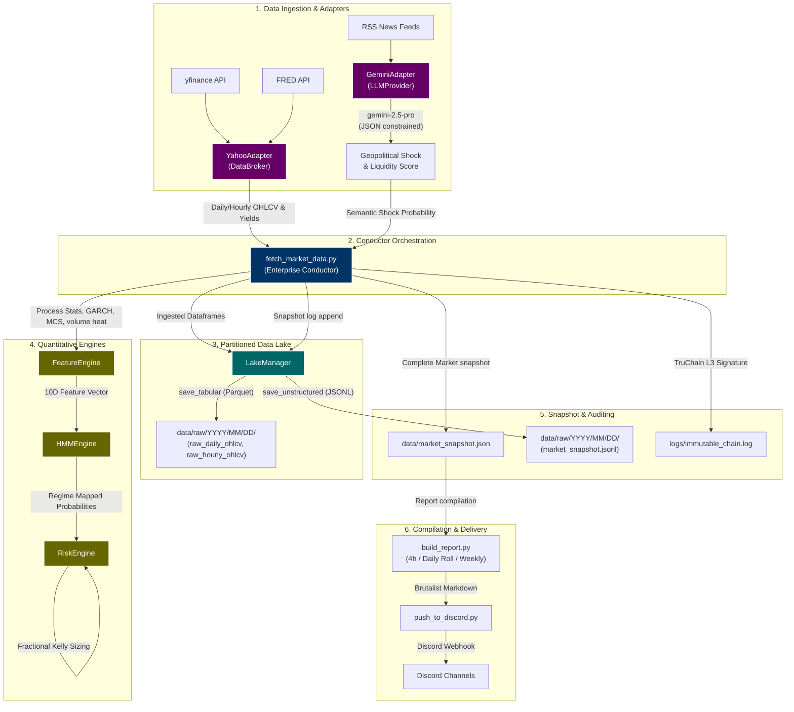

# Macro Briefing Agent Setup Guide (v4.5.0)

This guide provides step-by-step instructions on how to set up the macro briefing agent, configure Discord notifications, and automate the execution using cron jobs.

## Project Structure Overview
Following the v4.5.0 Enterprise Architecture refactor, the project is organized into a highly decoupled, professional modular pipeline:
- **`config/`**: Contains your API keys and webhook configurations (`fred_api_key.txt`, `webhook_config.txt`, `api_keys.json`, `tuning_configs.json`, etc.).
- **`src/`**: Houses the core Python code organized as modular packages:
  - **`interfaces/`**: Standardized OOP interfaces (`data_broker.py`, `llm_provider.py`) defining loose-coupling contracts.
  - **`adapters/`**: Physical retrieval clients (`yahoo_adapter.py` for yfinance/FRED, `gemini_adapter.py` for Gemini GenAI) implementing interface layers.
  - **`data_lake/`**: Database partition manager (`lake_manager.py`) handling daily-partitioned Parquet/JSONL.
  - **`engines/`**: Mapped quantitative processing and mathematical engines (`feature_engine.py`, `hmm_engine.py`, `risk_engine.py`).
  - **`observability/`**: Contextual logging layer (`logger.py`) routing logs to console and `system_events.jsonl`.
  - **`fetch_market_data.py`**: Central Enterprise Conductor orchestrating the ingestion and inference sequence using dependency injection.
  - **`build_report.py`, `build_weekly_synthesis.py`, `build_72h_roll.py`**: Presentation and formatting compilation scripts.
  - **`push_to_discord.py`**: Secured push delivery agent.
  - **`train_models.py`, `backtest.py`, `tune_hyperparameters.py`**: Model training, auditing, and tuning meta-agents.
  - **`visualize_math_4h.ipynb`, `visualize_math_1w.ipynb`**: Visual overlay Jupyter Notebooks.
- **`docs/`**: Documentation and System Architecture Manuals (`macro_agent_setup_v4.5.0.md`).
- **`data/`**: Local data snapshots and caches.
- **`data/raw/`**: The local partitioned Data Lake structured as `YYYY/MM/DD/` directories.
- **`models/`**: Saved machine learning models and scaler binaries.
- **`reports/`**: Mapped output briefings and backtest records.
- **`logs/`**: Execution, error, and immutable audit logs.
- **`older_versions/`**: Archived setup instructions from the legacy LLM era.

---

## v4.5.0 Enterprise Pipeline Architecture

The data pipeline has been upgraded from a monolithic workflow to an enterprise-grade decoupled ingestion and inference architecture:



---

## Core Script Ecosystem & Ingestion Flow

The Python architecture is structured as a modular quantitative pipeline. Below is the operational workflow and structural breakdown of the scripts housed in `src/`:

1. **`fetch_market_data.py` (The Enterprise Conductor Orchestrator)**
   - **Dependency Injection:** Instantiates and injects concrete providers (`YahooAdapter`, `GeminiAdapter`, `LakeManager`, `HMMEngine`, `RiskEngine`) to handle operations dynamically.
   - **Structured Logging (`src/observability/logger.py`):** Operates contextual loggers to route structured console prints and JSONL records to `data/logs/system_events.jsonl` with dynamic context filters.
   - **Ingestion & Data Lakeing (`src/data_lake/lake_manager.py`):** Ingests daily and hourly dataframes, immediately serializing them as Parquet tables under a daily partitioned structure: `data/raw/YYYY/MM/DD/`.
   - **Feature Construction (`src/engines/feature_engine.py`):** Computes GARCH volatility, Gold-to-Silver momentum, Institutional digital asset compose MFI scores, volume heat indicators, and the cryptographic TruChain blocks.
   - **regime Scoring (`src/engines/hmm_engine.py`):** Computes multi-fractal Hidden Markov Model probability maps over structural (daily) and tactical (hourly) feature horizons.
   - **Risk State Mapping (`src/engines/risk_engine.py`):** Runs the Kalman Filter sequence, measures Shannon Entropy uncertainty, and solves Fractional Kelly sizing exposure calibrated by past forecast Brier scores and half-life decays.
   - **NLP News Processor (`src/adapters/gemini_adapter.py`):** Utilizes JSON-constrained Gemini API parameters to decode news signals for strict shock and liquidity boundaries.

2. **`build_report.py` (Consensus Engine & 4-Hour Compiler)**
   - **Deterministic Voting:** Aggregates quantitative indicators into `ModelResult` dataclasses and computes conviction-weighted votes.
   - **Gemini NLP Threshold Conditioning:** Dynamic consensus voting thresholds are scaled automatically based on the Gemini semantically-decoded shock probabilities.
   - **Timeframe Conflict Resolution:** Automatically slashes the HMM Kalman conviction weight by 50% if the Tactical Hourly HMM contradicts the Structural Daily HMM.
   - **Epistemic Kelly Sizing:** Target portfolio exposure is loaded directly from the snapshot, calibrated by Brier score metrics and half-life decay thresholds.
   - **Presentation:** Formats the mathematical state matrices into the minimalist, Brutalist Markdown template, logs session updates, and triggers the Discord webhook pusher.

3. **`build_72h_roll.py` (72-Hour Cumulative Roll Compiler)**
   - **Roll Ingestion:** Scans the `/reports/updates` directory and parses filename timestamps.
   - **Aggregation:** Chronologically aggregates all briefing updates generated during the trailing 72 hours into a single master summary ledger.
   - **Garbage Collection:** Enforces a rigid 7-day file retention policy, automatically deleting stale files from the updates folder to keep the workspace clean.

4. **`build_weekly_synthesis.py` (Weekly Macro Research Synthesizer)**
   - **Narrative Assembly:** Executed weekly to build a comprehensive summary.
   - **Dual-Mode Generation:**
     * **LLM Mode (Online):** If a valid Gemini API key is configured, the script packages the week's end-of-week quantitative JSON and the chronological development log, feeding them to the `gemini-2.5-pro` model to write an institutional narrative synthesis.
     * **Deterministic Mode (Fallback):** If offline or the key is absent, the script falls back to a deterministic brutalist template mapping identical mathematical metrics.
   - **Delivery:** Triggers the Discord webhook agent to push the weekly summary.

5. **`push_to_discord.py` (Pusher Agent & Secure Gatekeeper)**
   - **Security Screening:** Runs input filenames through strict regex validation profiles to block malicious local directory path traversal.
   - **Metadata Extraction:** Parses briefing documents for session details, timestamps, sentiment headers, and system alerts.
   - **Embed Formatting:** Dynamically styles Discord embeds using alert-tier hex colors (Green for `ROUTINE`, Yellow for `ELEVATED`, Red for `CRITICAL`, Blue for `DAILY`).
   - **Notifications:** Coordinates automated role pings for higher-priority critical situations and securely uploads full markdown files under a 7MB size ceiling.

6. **`train_models.py` (Offline Machine Learning Training Pipeline)**
   - **Data Compiling:** Pulls 5 years of historical multi-asset data and fits GARCH volatility layers.
   - **HMM Calibration:** Standardizes the 10 aligned feature dimensions and fits a 6-state `GaussianHMM` with full covariance matrices over 500 EM iterations. Assigns state labels deterministically based on empirical SPX, yields, and oil emission means.
   - **MLP Calibration:** Trains a multi-layer perceptron neural network using a `(16, 8)` hidden layer topology with ReLU activation and Adam solver, mapping features to a 5-day forward cumulative return target (0=Risk-Off, 1=Risk-On, 2=Transitional). Saves both model binaries to `models/`.

7. **`backtest.py` (Empirical Backtest Audit Engine)**
   - **Viterbi Decoding:** Loads the active models and decodes 2 years of daily market features into chronological state labels sequence.
   - **Statistical Auditing:** Measures mean daily returns, annualizes SPX/WTI metrics, and compiles daily yield changes (in basis points) across all 6 regimes, outputting a clear performance audit (`reports/backtest_results.md`) to verify quantitative edge before live deployment.

8. **`tune_hyperparameters.py` (Hyperparameter Tuning Meta-Agent)**
   - **Macro Calibration:** A standalone scheduled python script that analyzes central bank summaries, FOMC minutes, or Beige Books via the Gemini LLM.
   - **JSON Configuration Injection:** Outputs structural macroeconomic velocity metrics into a local configuration schema (`tuning_configs.json`), allowing `fetch_market_data.py` to adapt dynamic half-life variables automatically.

9. **`visualize_math_4h.ipynb` & `visualize_math_1w.ipynb` (Dual Interactive Math Visualizers)**
   - **Visual Overlay:** Plots HMM state boundaries directly overlaid on the S&P 500 price chart.
   - **Fragility & Backwardation Heatmap:** Visualizes structural fragility states, including Volatility Term Structure backwards curves (VIX9D vs VIX).
   - **Gemini Geopolitical Shock Visualizer:** Plots semantic shock decodes against a horizontal red line representing the critical **0.70 Geopolitical Shock Trigger** boundary.
   - **Kelly Sizing Curves:** Plots real-time allocation transitions and duration half-life decay patterns natively within VS Code.
   - **Top-to-Bottom Report Injection:** Employs an automated cell (**Section 5: Generated Report Layout**) at the bottom of both notebooks that sweeps your local report directories to locate the most recent raw Markdown briefing (`4 hours update` or `macro weekly synthesis`) and renders it seamlessly directly below the charts.

## Data Privacy & Security Architecture

To protect proprietary trading strategies, local model calibrations, and personal API keys, this repository implements a strict **zero-sharing security architecture**. All sensitive parameters, private execution logs, locally trained model binaries, and generated briefings are strictly ignored by `.gitignore` and kept local.

To set up the agent locally without exposing your personal keys or data, copy the provided skeleton templates to their active counterparts:

### Configuration Templates (`config/`)
- `fred_api_key.example.txt` -> `fred_api_key.txt` (Holds Federal Reserve API keys)
- `gemini_api_key.example.txt` -> `gemini_api_key.txt` (Holds Gemini LLM API keys)
- `webhook_config.example.txt` -> `webhook_config.txt` (Holds Discord webhook channel URLs)
- `api_keys.example.json` -> `api_keys.json` (Holds Google Gemini API keys for hyperparameter tuning & news processing)
- `tuning_configs.json` (Generated locally by the hyperparameter meta-agent)

### Offline Data Templates (`data/`)
- `market_snapshot.example.json` -> `market_snapshot.json` (Local market metric skeleton)
- `predictions_history.example.json` -> `predictions_history.json` (Past inference accuracy tracker)

This architecture guarantees that all private API credentials, locally computed GARCH volatilities, model weights, and session briefings are completely insulated, preventing accidental leaks to public code repositories.

## 1. Agent Setup

### Prerequisites
Ensure you have **Python 3** installed on your system. You will also need to install the required Python packages.

1. Open your terminal and navigate to the agent directory:
   ```bash
   cd /Users/mac/agent
   ```
2. Install the required dependencies:
   ```bash
   pip3 install yfinance pandas numpy requests joblib arch matplotlib seaborn jupyter
   ```

### API Keys & Configuration Setup
To configure operational parameters, API keys, and configurations:

1. **FRED API Yield Feeds:**
   - Go to the [FRED website](https://fred.stlouisfed.org/) and register to get a free FRED API key.
   - Duplicate the FRED API example configuration file:
     ```bash
     cp config/fred_api_key.example.txt config/fred_api_key.txt
     ```
   - Open `config/fred_api_key.txt` and paste your API key. (Or `export FRED_API_KEY="your_key"`).

2. **Gemini LLM Integrations (News Parsing & Hyperparameter Tuning):**
   - Obtain a Gemini API key from Google AI Studio.
   - Duplicate the Gemini API JSON-keys example template:
     ```bash
     cp config/api_keys.example.json config/api_keys.json
     ```
   - Open `config/api_keys.json` and paste your Gemini API key:
     ```json
     {
       "GEMINI_API_KEY": "your_actual_key_here"
     }
     ```

3. **Weekly LLM Synthesis (Optional):**
   - Duplicate the Gemini weekly synthesizer text key:
     ```bash
     cp config/gemini_api_key.example.txt config/gemini_api_key.txt
     ```
   - Open `config/gemini_api_key.txt` and paste your key.

---

## 2. System Architecture & Technical Manual

The agent is now structured under the **v4.5.0 Enterprise Architecture**, featuring loose-coupling OOP components, structured contextual loggers, partitioned databases, and specialized mathematical engines.

For a full breakdown of the mathematical engines, data ingestion layers, Kelly sizing decay penalties, and consensus logic, please refer to the **Technical Developer Manual** located at:
`docs/macro_agent_setup_v4.5.0.md`

---


## 3. Discord Push Setup

The agent can push generated reports to a Discord channel using a webhook.

### Create a Webhook
1. Open Discord and go to the channel where you want the reports to be sent.
2. Click the gear icon next to the channel name to open **Edit Channel**.
3. Go to **Integrations** > **Webhooks** > **New Webhook**.
4. Name your webhook and click **Copy Webhook URL**.

### Configure the Agent
1. Copy the pre-packaged webhook example file to its active name:
   ```bash
   cp config/webhook_config.example.txt config/webhook_config.txt
   ```
2. Open `config/webhook_config.txt` in the agent folder.
3. Paste your copied Webhook URL into this file and save it.
4. (Optional) If you want to ping a specific role for Elevated/Critical alerts, open `config/role_config.txt` and paste the Discord Role ID (e.g., `<@&1234567890>`). If left empty, it defaults to `@here`.

---

## 4. Cron Job Setup

To fully automate the agent, you can schedule the bash scripts using your system's cron daemon. `cron` runs silently in the background and executes scripts at specific times or intervals.

**Note on Sleep Mode:** 
Cron requires your Mac to be awake. If your Mac goes to sleep, the cron job will skip any scheduled runs that occur while asleep. It will resume once the Mac wakes up.

### Setting Up the Automation
1. Open your terminal and edit your crontab:
   ```bash
   crontab -e
   ```
2. Add the following entries to schedule the different reports. Make sure to use the absolute paths to the scripts.

   ```cron
   # Run the 4-hour automated pipeline (every 4 hours)
   0 */4 * * * /Users/mac/agent/run_4h.sh >> /Users/mac/agent/logs/cron.log 2>&1

   # Run the daily 72-hour roll push (every day at 8:00 AM)
   0 8 * * * /Users/mac/agent/run_daily.sh >> /Users/mac/agent/logs/cron.log 2>&1

   # Run the weekly synthesis pipeline (every Sunday at 10:00 AM)
   0 10 * * 0 /Users/mac/agent/run_weekly.sh >> /Users/mac/agent/logs/cron.log 2>&1
   ```
3. Save and exit the editor. Your cron jobs are now scheduled!

### How to "Catch Up"
If your Mac was asleep and missed a run, you can always catch up manually! Just open your terminal and run the exact absolute path for whichever script you missed (you don't need to change folders, just copy/paste these):
- Missed a 4-hour update? Run: `/Users/mac/agent/run_4h.sh`
- Missed the daily Discord push? Run: `/Users/mac/agent/run_daily.sh`
- Missed the Sunday weekly report? Run: `/Users/mac/agent/run_weekly.sh`

### How to Pause or Remove the Automation
**To Pause (Temporarily Disable):**
1. Run `crontab -e`
2. Add a hashtag `#` at the beginning of the lines to comment them out.
3. Save and exit.

**To Remove Permanently:**
1. Run `crontab -e`
2. Delete the lines completely.
3. Save and exit.
*(Alternatively, running `crontab -r` in the terminal will wipe your entire schedule).*

---

## 5. Offline Model Training & Backtesting

The agent's deep learning components (HMM and MLP Classifier) are not static. You must periodically retrain them on new market data to maintain their edge.

1. Once a quarter, open your terminal.
2. Run the offline training script:
   ```bash
   python3 /Users/mac/agent/src/train_models.py
   ```
3. The script will fetch 5 years of historical data, re-fit the Hidden Markov Models, retrain the Deep Neural Network, and generate updated historical performance statistics in `reports/backtest_results.md`.
4. The agent will automatically begin using the updated models on its next 4-hour cron cycle!

---

## 6. Interactive Mathematical Visualization (Jupyter)

The agent includes interactive visual verification and analytics dashboards that run natively in your editor (e.g., VS Code with the Jupyter extension):

1. Ensure the graphing and notebook packages are installed:
   ```bash
   pip3 install matplotlib seaborn jupyter
   ```
2. Open either **`src/visualize_math_4h.ipynb`** (for 4-hour briefings) or **`src/visualize_math_1w.ipynb`** (for weekly synthesis summaries) in your IDE.
3. Click **"Run All"** to execute the analytics cells.
4. The notebook will automatically query your active model weights and historical data to render publication-grade plots and text layouts:
   - **HMM Regimes Overlay:** Highlights underlying market regimes directly onto the S&P 500 price chart.
   - **Fragility & Backwardation Heatmap:** Visualizes structural fragility states, including Volatility Term Structure backwards curves (VIX9D vs VIX).
   - **Gemini Geopolitical Shock Visualizer:** Plots semantic shock decodes against a horizontal red line representing the critical **0.70 Geopolitical Shock Trigger** boundary.
   - **Kelly Sizing Curves:** Plots the Fractional Kelly size allocations, calibration degradation, and transition decay paths.
   - **Seamless Report Injection (Section 5):** The notebook automatically hunts down and embeds the most recent raw markdown report generated by your catch-up pipelines directly inside the notebook below the charts, giving you a complete top-to-bottom mathematical-to-narrative presentation.

---

## 7. Troubleshooting & Logs

Because Cron runs invisibly, you won't see pop-ups if it succeeds or fails. To check on it, you can view the log file. Both the Python scripts and your cron jobs will write out helpful error messages there.

Open Terminal and run this command to see the latest activity:
```bash
tail -n 20 /Users/mac/agent/logs/cron.log
```
This will show you the output of the most recent automated runs!

---

## 8. Versioning System & Patch Notes
Whenever changes are made to the system architecture, automatically update the version number in the title and summarize the patch notes to the user.
- **Big change** (e.g., major feature additions): Increment minor version (x.1 to 9). Example: v1.3.x -> v1.4.0
- **Small change** (e.g., prompt tweak, new section): Increment patch version (x.x.1 to 9). Example: v1.3.1 -> v1.3.2
- **Tiny change** (e.g., typo fix, formatting): Increment sub-patch version (x.x.x.1 to 9). Example: v1.3.1 -> v1.3.1.1

### Patch Notes:
- **v4.5.0** (Enterprise Architecture Refactor):
  - **[ADDED] Decoupled Interface Layers:** Standardized `DataBroker` and `LLMProvider` abstract interface classes under `src/interfaces/`.
  - **[ADDED] Modular Adapter Components:** Added `YahooAdapter` and `GeminiAdapter` under `src/adapters/` implementing OOP contracts.
  - **[ADDED] Partitioned Data Lake Engine:** Implemented `LakeManager` under `src/data_lake/` handling daily-partitioned Parquet (`save_tabular`) and JSONL (`save_unstructured`) under `data/raw/YYYY/MM/DD/`.
  - **[ADDED] Decoupled Math & Inference Engines:** Separated statistical/MCS indicators (`src/engines/feature_engine.py`), Hidden Markov Models (`src/engines/hmm_engine.py`), and Kalman/Shannon/Kelly sizing (`src/engines/risk_engine.py`).
  - **[ADDED] Contextual Observability logging:** Implemented a structured logger under `src/observability/logger.py` producing contextualized logs in human-readable and structured JSONL format under `data/logs/system_events.jsonl`.
  - **[MODIFIED] Conductor Orchestrator:** Upgraded `src/fetch_market_data.py` into a clean Conductor pattern employing Dependency Injection (DI) to run data gathering and engines dynamically.
- **v4.2.0** (Multi-Fractal & LLM Hybrid Upgrade):
  - **[ADDED]** Integrated Volatility Term Structure utilizing `VIX9D` and `VIX3M` to calculate backwardation stress and penalize structural fragility.
  - **[ADDED]** Multi-Fractal timeframe execution running structural (Daily) and tactical (Hourly) Hidden Markov Models concurrently.
  - **[ADDED]** Consensus conflict resolution rules to automatically slash HMM conviction scores by 50% on Daily vs Hourly regime contradictions.
  - **[MODIFIED]** Replaced VADER sentiment scoring with a structured, JSON-constrained Google Gemini LLM news processor (`api_keys.json`) to analyze semantic risk limits.
  - **[ADDED]** Hyperparameter Tuning Meta-Agent (`tune_hyperparameters.py`) to extract central bank transcripts and Beige Books to dynamically overwrite mathematical half-lives (`tuning_configs.json`).
  - **[ADDED]** Section 6 visual overlay plotting Volatility Term Structure and Gemini Geopolitical Shock boundaries (0.70 red line).
- **v4.1.0.1** (Path Tweak):
  - **[FIXED]** Patched the 4-hour visualizer notebook (`visualize_math_4h.ipynb`) directory pointer from `../reports` to `../reports/updates` to correctly scan and render the latest 4-hour briefings.
- **v4.1.0** (Math Visualization Update):
  - **[ADDED]** Created interactive dual Jupyter Notebooks `src/visualize_math_4h.ipynb` and `src/visualize_math_1w.ipynb` to support native mathematical and regime visual verification in VS Code.
  - **[ADDED]** Added a dynamic report injection section (**Section 5: Generated Report Layout**) to automatically locate and inject the most recent polished Markdown briefing directly below the mathematical graphs.
  - **[ADDED]** Graphing and notebook dependencies (`matplotlib`, `seaborn`, `jupyter`) integrated into prerequisites.
  - **[ADDED]** Real-time visualization of HMM S&P 500 regime overlays, Fragility heatmaps, and Fractional Kelly transition curves.
- **v4.0.1** (Stealth NLP Update):
  - **[REMOVED]** Raw NLP headline lists are stripped from reports (`build_report.py` and `build_weekly_synthesis.py`) to maintain a professional, minimalist, data-dense brutalist aesthetic.
  - **[ADDED]** Shifted NLP analysis to **Background Stealth Persistence mode**. Yahoo Finance RSS news feeds are autonomously fetched and scored using VADER sentiment analysis.
  - **[ADDED]** sentiment scores are interpreted as **Absolute Shock Magnitudes** (absolute variance of sentiment compound scores) to model volatility shock.
  - **[ADDED]** News signal shocks and macro keyword clusters dynamically scale the `news_impact` vector and raise consensus voting threshold from 0.60 to 0.65 to insulate the system from news-driven noise.

*Note to agent: After every change, ensure the title reflects the new version and summarize the patch notes to the user.*

---

## 9. Instant Quick-Start (Offline Skeleton Mode)

If you are a new user and want to immediately test the report generation interface offline without fetching live Yahoo Finance/FRED APIs or setting up API keys, follow these two steps:

1. Copy the pre-packaged skeleton files in the `data/` directory to their active file names:
   ```bash
   cp data/market_snapshot.example.json data/market_snapshot.json
   cp data/predictions_history.example.json data/predictions_history.json
   ```
2. Manually generate a test report instantly by running the report compiler:
   ```bash
   python3 src/build_report.py
   ```

The script will instantly parse the offline skeleton metrics, execute the voting consensus matrices, and produce a beautifully structured, institutional-grade market briefing under `reports/updates/`—working entirely offline!

