# Macro Briefing Agent Setup Guide (v6.4.0)

Welcome to the **Macro Briefing Agent (v6.4.0)**—a 24/7 autonomous containerized **Multi-Asset Trading Terminal & Dynamic Conviction Edge OS**. This project decouples data ingestion, economic calendars, LLM synthesis, consensus scaling, and pub-sub event dispatching into an enterprise-grade framework.


## Project Structure Overview
Following the v6.4.0 update and audit fixes, the project is organized into a highly decoupled, professional modular pipeline:
- **`config/`**: Contains your API keys and webhook configurations (`fred_api_key.txt`, `webhook_config.txt`, `api_keys.json`, `tuning_configs.json`, etc.).
- **`src/`**: Houses the core Python code organized as modular packages:
  - **`interfaces/`**: Standardized OOP interfaces (`data_broker.py`, `llm_provider.py`) defining loose-coupling contracts.
  - **`adapters/`**: Physical retrieval clients (`yahoo_adapter.py` for dynamic interval and yield history, `gemini_adapter.py` for LLM analysis, `forexfactory_adapter.py` for economic calendars, `paper_broker.py` for simulated execution rebalancing) implementing interface layers.
  - **`data_lake/`**: Database partition manager (`lake_manager.py`) handling daily-partitioned Parquet/JSONL.
  - **`engines/`**: Specialized engines (`feature_engine.py` for dynamic stats, return percentages and yield shifts, `hmm_engine.py` for regime and GARCH penalty filters, `risk_engine.py` for covariance noise & Kelly overrides, `consensus_engine.py` for signal mapping, `frequency_controller.py` for dynamic trading cadences, `rl_agent.py` for PPO-based reinforcement learning portfolio sizing).
  - **`observability/`**: Standardized context logging (`logger.py`) and pub-sub event dispatching (`event_bus.py`).
  - **`schemas/`**: Strict type-validation layer (`models.py`) housing Pydantic models for the entire pipeline state.
  - **`fetch_market_data.py`**: Central Conductor orchestrating the ingestion, inference, RL sizing, and paper execution sequence using dependency injection.
  - **`build_report.py`, `build_weekly_synthesis.py`**: Presentation and formatting compilation scripts.
  - **`push_to_discord.py`**: Secured push delivery agent.
  - **`training/`**: `rl_environment.py`, `rl_trainer.py`, `train_models.py`, `backtest.py`, `tune_hyperparameters.py` for model training, reinforcement learning, auditing, and tuning meta-agents.
  - **`generate_visual_map.py`**: Centralized stacked portfolio visualization generator script.
  - **`visualize_paper_trading.py`**: Paper trading dashboard plotter and Excel ledger exporter.
- **`docs/`**: Documentation and System Architecture Manuals (`concept_and_model.md`).
- **`data/`**: Structured subdirectories isolating state and logs:
  - **`data/state/`**: Active validations snapshot matrices (`market_snapshot.json`, `market_snapshot_prior.json`).
  - **`data/predictions/`**: Calibration forecast history logs (`mlp_predictions_history_{interval}.json`).
  - **`data/telemetry/`**: Phase 2 telemetry metrics payload (`live_telemetry.json`).
  - **`data/paper_trading/`**: Live simulated paper portfolios and transaction ledgers (`paper_portfolio.json`, `paper_ledger.csv`).
  - **`data/raw/`**: The local partitioned Data Lake structured as `YYYY/MM/DD/` directories housing Parquet price tables and partitioned event logs (`events.jsonl`).
- **`models/`**: Saved machine learning models and scaler binaries.
- **`reports/`**: Mapped output briefings, backtest records, paper trading PNG dashboards, and XLSX spreadsheets.
- **`logs/`**: Execution, error, and immutable audit logs.
- **`Dockerfile`, `docker-compose.yml`, `requirements.txt`**: Complete containerization and deployment configurations.

---

## Docker Architecture & Storage

This system is fully containerized for seamless, reproducible deployment. The architecture utilizes two main containers:
- **`quant_backend`**: A headless Python container that runs the internal `APScheduler` and the FastAPI server. It handles data ingestion, ML inference, paper trading execution, and JSON state management.
- **`quant_frontend`**: Serving the compiled React/Vite Glassmorphism dashboard on Port 80.

### Where is the container data stored?
Docker containers are managed internally by the Docker Engine, but **all of your actual data and configurations are securely stored inside your `agent` folder**.
We use **Docker Bind Mounts** in `docker-compose.yml` to achieve this:
- `./data:/app/data`: Your market snapshots, logs, paper trading ledgers, and data lakes are saved directly to your Mac.
- `./config:/app/config`: Your API keys and webhooks are mapped natively to the backend container.

Because the data physically lives in your `agent` directory, **the folder is completely portable**. You can safely stop the containers, move the folder to a cloud server, and run `docker-compose up` without losing your paper trading history or trained models.

### Docker Quickstart
To boot the entire OS, open your terminal inside the `agent` folder and run:
```bash
# Build and start the backend and frontend
docker-compose up -d --build

# View real-time logs
docker logs -f quant_backend
```

---

## v6.4.0 Multi-Asset Trading Terminal & Dynamic Conviction Edge OS

The data pipeline operates as an enterprise-grade containerized event-driven OS featuring parallel LLM experts, step-by-step Chain-of-Thought (CoT) verification, and quantitative divergence protection filters:

```mermaid
graph TD
    %% Define Styles & Classes (Curated HSL tailored soft color scheme)
    classDef IngestStyle fill:#f7fafc,stroke:#e2e8f0,stroke-width:1.5px,color:#4a5568;
    classDef ConductorStyle fill:#ebf8ff,stroke:#bee3f8,stroke-width:2px,color:#2b6cb0;
    classDef EngineStyle fill:#faf5ff,stroke:#e9d8fd,stroke-width:2px,color:#553c9a;
    classDef MoEStyle fill:#fffaf0,stroke:#feebc8,stroke-width:2px,color:#c05621;
    classDef OutputStyle fill:#f0fff4,stroke:#c6f6d5,stroke-width:2px,color:#22543d;

    %% 1. Data Ingestion & Timeframe Adapters
    subgraph Ingestion["1. Multi-Timeframe Data Ingestion & Fallbacks"]
        YF["yfinance API (Dynamic Interval)"] --> YA["YahooAdapter (fetch_yield_history)"]
        FRED["FRED API"] -->|"Optional Key"| YA
        YA -->|"Missing FRED Key Fallback"| Fallback["Yahoo proxy yields (^TNX & ^FVX)"]
        FF["Forex Factory API"] --> FA["ForexFactoryAdapter"]
        News["RSS News Feeds"] --> GA["GeminiAdapter"]
    end

    %% 2. Processing & Conductor Phase
    subgraph Conductor["2. Event-Driven Conductor & Database Inception"]
        Cond["fetch_market_data.py --interval [1d/1wk/4h/1h]"]
        Bus["EventBus (src/observability/event_bus.py)"]
        Lake["LakeManager (data_lake/)"]
        DailyPart["data/raw/YYYY/MM/DD/<br>(raw_daily_ohlcv.parquet, raw_hourly_ohlcv.parquet)"]
        EventLog["data/raw/YYYY/MM/DD/events.jsonl"]
        
        YA --> Cond
        Fallback --> Cond
        FA --> Cond
        GA --> Cond
        Cond -->|"SystemStart"| Bus
        Bus -->|"All fired events intercepted"| Lake
        Lake -->|"save_tabular (Parquet)"| DailyPart
        Lake -->|"Global Event Intercept"| EventLog
    end

    %% 3. Quantitative Mathematical Engines & Validation Checkpoints
    subgraph Engines["3. Quantitative Mathematical Engines & Type-Safety"]
        FE["FeatureEngine (Dynamic Rolling Window returns & spreads)"]
        Schema1["Pydantic Schema: 14-Feature Vector<br>(spx_ret, dxy_ret, vix_zscore, Inst_Heat_Index, wti_ret,<br>gsr_ret, us10y_delta, spread_level, btc_ret, usdcad_ret,<br>es_ret, nq_ret, ym_ret, rty_ret)"]
        HMM["HMMEngine (Uniform Start & VIX GARCH Penalty Filter)"]
        Schema2["Pydantic Schema: RegimeState"]
        RE["RiskEngine (Dynamic Measurement Noise & Ensembles)"]
        EnsembleInference["Ensemble Classifiers (MLP + RF + GB)<br>for SPX, BTC, GLD, WTI"]
        CalibCheck{"Brier Score > 0.60?"}
        AutoInversion["Auto-Inversion Module<br>(Flip Probability: 1 - p)"]
        ConsensusCheck["Model Consensus Scoring<br>(Standard Dev < 0.15)"]
        Schema3["Pydantic Schema: RiskState"]
        
        DailyPart --> FE
        FE -->|"Process 14 metrics & daily/hourly yield changes"| Schema1
        Schema1 -->|"Aligned feature vectors"| HMM
        HMM -->|"VIX z-score GARCH Bayesian Penalty Filter"| Schema2
        Schema2 -->|"KalmanFilter & Dynamic Measurement Noise R"| RE
        RE --> EnsembleInference
        EnsembleInference --> CalibCheck
        CalibCheck -->|Yes| AutoInversion
        CalibCheck -->|No| ConsensusCheck
        AutoInversion --> ConsensusCheck
        ConsensusCheck -->|"1.5x Kelly consensus boost / 0.5x penalty"| Schema3
    end

    %% 4. Single LLM Expert
    subgraph LLM["4. Single LLM Expert"]
        MacroEx["Gemini Macro Expert"]
        
        Schema3 -->|"Quant Context Ingestion"| MacroEx
    end

    %% 5. Sizing Overrides & Sizing Allocations
    subgraph Consensus["5. Sizing Overrides & Sizing Allocations (v6.4.0)"]
        ConsensusEng["ConsensusEngine (engines/consensus_engine.py)"]
        DivergeCheck{"VIX z-score > 1.5<br>& Bullish Headlines?"}
        DivergeSlash["Apply 0.5x Divergence Slash<br>(All Longs except GLD)"]
        
        Overrides["System Sizing Overrides & Safety Circuit Breakers:<br>• Dynamic Asset Conviction Edge (SPX > 50%, BTC/GLD > 52%, NVDA > 53%, WTI/DELL > 54-55%, TSLA > 56%, SPCE > 72%)<br>• Black Swan Circuit Breaker (SPX return z < -3.5): Force SPX Kelly = 0.0<br>• Capitulation Override: 0.9x contrarian Kelly<br>• Auto-Inversion Calibration: 1 - prob if Brier Score > 0.60"]
        
        RLAgent["RLAgent (engines/rl_agent.py)<br>[Disabled/Bypass]"]
        AssetAlloc["compute_multi_asset_kelly (Primary Allocator)<br>• Runs AFTER Regime & HMM Coherence Gates<br>• Maps Short_Kelly to SH Inverse ETF"]
        Balancer["Global Portfolio Balancer (Normalize to 1.2 leverage ceiling)"]
        
        MacroEx -->|"CoT reasoning contract"| ConsensusEng
        ConsensusEng --> DivergeCheck
        DivergeCheck -->|Yes| DivergeSlash
        DivergeCheck -->|No| Overrides
        DivergeSlash --> Overrides
        Overrides --> AssetAlloc
        AssetAlloc --> Balancer
    end

    %% 6. Snapshot, Reporting & Telemetry
    subgraph Output["6. Persistent Event Logging, Presentation & Paper Trading"]
        Snap["Validated Market Snapshot (data/state/market_snapshot.json)"]
        Telem["Live Telemetry File (data/telemetry/live_telemetry.json)"]
        PB["PaperBroker (data/paper_trading/paper_portfolio.json)"]
        Ledger["Paper Ledger (data/paper_trading/paper_ledger.csv)"]
        VPT["visualize_paper_trading.py"]
        ExcelDash["Reports (paper_trading_performance.png & .xlsx)"]
        VM["generate_visual_map.py"]
        VisMap["visualize_map.png (Stacked allocation charts)"]
        BR["build_report.py (v6.4.0 presenter)"]
        PD["push_to_discord.py"]
        Discord["Discord Channels"]
        
        Balancer -->|"SPX Long & Short / BTC / GLD / WTI / Cash"| Snap
        Balancer -->|"Live Telemetry Output"| Telem
        Balancer -->|"Kelly Target Allocations"| PB
        PB -->|"Log execution (5 bps slippage, SH Inverse ETF mapping)"| Ledger
        Ledger --> VPT
        VPT -->|"Performance plots & spreadsheets"| ExcelDash
        Snap -->|"Retrieve from events.jsonl"| BR
        Snap -->|"Parse backtest daily log"| VM
        VM --> VisMap
        BR -->|"Renders Multi-Asset allocations in Brutalist Markdown"| PD
        PD -->|"Discord Webhook"| Discord
    end

    %% Assign classes for beautiful HSL pastel styling
    class YF,FRED,YA,Fallback,FF,FA,News,GA IngestStyle;
    class Cond,Bus,Lake,DailyPart,EventLog ConductorStyle;
    class FE,Schema1,HMM,Schema2,RE,EnsembleInference,CalibCheck,AutoInversion,ConsensusCheck,Schema3 EngineStyle;
    class MacroEx MoEStyle;
    class ConsensusEng,DivergeCheck,DivergeSlash,Overrides,AssetAlloc,Balancer MoEStyle;
    class Snap,Telem,PB,Ledger,VPT,ExcelDash,VM,VisMap,BR,PD,Discord OutputStyle;
```


## Core Script Ecosystem & Ingestion Flow

The Python architecture is structured as a modular quantitative pipeline. Below is the operational workflow and structural breakdown of the scripts housed in `src/`:

1. **`fetch_market_data.py` (The Enterprise Conductor Orchestrator)**
   - **Dependency Injection:** Instantiates and injects concrete providers (`YahooAdapter`, `ForexFactoryAdapter`, `GeminiAdapter`, `LakeManager`, `HMMEngine`, `RiskEngine`, `ConsensusEngine`, `PaperBroker`) dynamically.
   - **EventBus Pub-Sub Sequence (`src/observability/event_bus.py`):** Runs the pipeline as a series of decoupled events (`SystemStart` -> `DataFetched` -> `FeaturesEngineered` -> `EnginesCompleted` -> `PipelineComplete`).
   - **Structured Logging & Global Interception (`src/data_lake/lake_manager.py`):** Captures every event fired in the system and logs it directly to `events.jsonl` under daily partitioned folders: `data/raw/YYYY/MM/DD/events.jsonl`.
   - **Type-Safe Validation (`src/schemas/models.py`):** Enforces strict data structure contracts using Pydantic, incorporating `EconomicCalendar` and `EconomicEvent` schemas.
   - **Asset Ingestion & Parquet Partitioning:** Ingests price series and economic calendar feeds, saving them to daily partitioned Parquet tables.
   - **Feature Construction (`src/engines/feature_engine.py`):** Computes returns, Gold-to-Silver ratio, volume heat, credit stress, indices, and 14-feature space matrices.
   - **Regime Inference & Sizing (`src/engines/hmm_engine.py` & `src/engines/risk_engine.py`):** Computes multi-fractal regimes, runs Kalman filter state tracking, and solves Kelly portfolio sizing.
   - **Mixture of Experts & CoT Synthesis (`src/adapters/gemini_adapter.py` & `src/engines/consensus_engine.py`):** 
     - Runs the Macro Policy and Market Psychology experts in parallel using `ThreadPoolExecutor`.
     - Synthesizes their CoT step-by-step reasoning blocks and scores into a unified `NewsSignal`.
     - **Critical Divergence Slasher:** If news is extremely bullish, but VIX z-score spikes > 1.5, triggers `quantitative_divergence_flag: true` to dynamically slash Kelly exposure by half (0.5x multiplier) to defend capital.
     - Employs `gemini-2.5-flash` to gracefully bypass quota 429 errors.
   - **Paper Broker Execution (`src/adapters/paper_broker.py`):** Simulates real-time rebalancing based on Kelly target fractions with 5 bps slippage, logging to `data/paper_trading/paper_ledger.csv`, and publishing embedded trade execution alerts directly to Discord.

2. **`build_report.py` (Consensus Engine & Presentation Compiler)**
   - **Resilient Log Fetching:** Scans the data lake partitions, finds the latest `events.jsonl` log file, extracts the `PipelineComplete` event payload, and validates it against the `MarketSnapshot` Pydantic model.
   - **Deterministic Voting:** Aggregates quantitative indicators and computes conviction-weighted votes.
   - **Epistemic Kelly Sizing:** Solves target portfolio exposure sizing calibrated by Brier scores and regime decays. Applies a **1.2x aggressive multiplier** (up to 120% exposure) during liquidity-driven rallies, a **0.5x slasher** during rate shocks, and a **0.5x capital slasher** during quantitative narrative-reality divergences.
   - **Presentation:** Formats the mathematical state matrices, `Quant Divergence` status, and step-by-step `[ LLM REASONING ]` CoT logical synthesis blocks into the minimalist Brutalist Markdown template, and triggers the Discord webhook pusher.

3. **`build_weekly_synthesis.py` (Weekly Macro Research Synthesizer)**
   - **Narrative Assembly:** Executed weekly to build a comprehensive summary.
   - **Resilient Log Fetching:** Reads the latest `events.jsonl` daily partitioned event logs and validates the snap using `MarketSnapshot`.
   - **Dual-Mode Generation:** Always outputs the deterministic mathematical matrix, and appends the Gemini-Flash generated weekly synthesis incorporating the 30-day quantitative memory log.
   - **Delivery:** Triggers the Discord webhook agent to push the weekly summary.

4. **`push_to_discord.py` (Pusher Agent & Secure Gatekeeper)**
   - **Security Screening:** Runs input filenames through strict regex validation profiles to block malicious local directory path traversal.
   - **Metadata Extraction:** Parses briefing documents for session details, timestamps, sentiment headers, and system alerts.
   - **Embed Formatting:** Dynamically styles Discord embeds using alert-tier hex colors (Green for `ROUTINE`, Yellow for `ELEVATED`, Red for `CRITICAL`, Blue for `DAILY`).
   - **Notifications:** Coordinates automated role pings for higher-priority critical situations and securely uploads full markdown files under a 7MB size ceiling.

5. **`train_models.py` (Offline Machine Learning Training Pipeline)**
   - **Data Compiling:** Pulls 5 years of historical multi-asset data including equities, index futures, dollar index, commodities, and volatility.
   - **HMM Calibration:** Standardizes the 14 aligned feature dimensions (S&P 500, DXY, VIX, WTI, GSR, USDCAD, BTC, US10Y daily change, 2s10s spread, and returns of ES, NQ, YM, RTY futures) and fits a 6-state `GaussianHMM` with full covariance matrices over 500 EM iterations.
   - **MLP Calibration:** Trains a multi-layer perceptron neural network using a `(16, 8)` hidden layer topology with ReLU activation and Adam solver, mapping features to a 5-day forward cumulative return target (0=Risk-Off, 1=Risk-On, 2=Transitional). Saves model binaries to `models/`.

6. **`backtest.py` (Empirical Backtest Audit Engine)**
   - **Viterbi Decoding:** Loads the active models and decodes 2 years of daily market features into chronological state labels sequence.
   - **Statistical Auditing:** Measures mean daily returns, annualizes SPX/WTI metrics, and compiles daily yield changes (in basis points) across all 6 regimes, outputting a clear performance audit (`reports/backtest_extended_results.md`) to verify quantitative edge before live deployment.

7. **`tune_hyperparameters.py` (Hyperparameter Tuning Meta-Agent)**
   - **Macro Calibration:** A standalone scheduled python script that analyzes central bank summaries, FOMC minutes, or Beige Books via the Gemini LLM.
   - **JSON Configuration Injection:** Outputs structural macroeconomic velocity metrics into a local configuration schema (`tuning_configs.json`), allowing `fetch_market_data.py` to adapt dynamic half-life variables automatically.

8. **`visualize_paper_trading.py` (Paper Trading Performance Dashboard)**
   - **Performance curves:** Computes and plots curves tracking realized returns, unrealized equity fluctuations, net PnL, and cumulative transaction friction fees paid.
   - **Chronological Ledgers:** Exports execution logs to a dual-sheet spreadsheet `/Users/mac/agent/reports/paper_trading_performance.xlsx` containing the comprehensive trade ledger and performance metrics summary.

9. **`visualize_math_4h.ipynb` & `visualize_math_1w.ipynb` (Dual Interactive Math Visualizers)**
   - **Visual Overlay:** Plots HMM state boundaries directly overlaid on the S&P 500 price chart.
   - **Fragility & Backwardation Heatmap:** Visualizes structural fragility states, including Volatility Term Structure backwards curves (VIX9D vs VIX).
   - **Gemini Geopolitical Shock Visualizer:** Plots semantic shock decodes against a horizontal red line representing the critical **0.70 Geopolitical Shock Trigger** boundary.
   - **Kelly Sizing Curves:** Plots real-time allocation transitions and duration half-life decay patterns natively within VS Code.
   - **LLM CoT Reasoning cell (Section 5):** Automatically extracts and displays the `Quant Divergence` status and `[ LLM REASONING ]` Chain-of-Thought logical synthesis natively inside VS Code below the mathematical charts.

## Data Privacy & Security Architecture

To protect proprietary trading strategies, local model calibrations, and personal API keys, this repository implements a strict **zero-sharing security architecture**. All sensitive parameters, private execution logs, locally trained model binaries, and generated briefings are strictly ignored by `.gitignore` and kept local.

To set up the agent locally without exposing your personal keys or data, copy the provided skeleton templates to their active counterparts:

### Configuration Templates (`config/`)
- `fred_api_key.example.txt` -> `fred_api_key.txt` (Holds Federal Reserve API keys)
- `gemini_api_key.example.txt` -> `gemini_api_key.txt` (Holds Gemini LLM API keys)
- `webhook_config.example.txt` -> `webhook_config.txt` (Holds Discord webhook channel URLs)
- `api_keys.example.json` -> `api_keys.json` (Holds Google Gemini API keys for hyperparameter tuning & news processing)
- `tuning_configs.json` (Generated locally by the hyperparameter meta-agent)

### Offline Data Templates (`data/`)
- `market_snapshot.example.json` -> `market_snapshot.json` (Local market metric skeleton)
- `predictions_history.example.json` -> `predictions_history.json` (Past inference accuracy tracker)

This architecture guarantees that all private API credentials, locally computed GARCH volatilities, model weights, and session briefings are completely insulated, preventing accidental leaks to public code repositories.

## 1. Agent Setup

### Prerequisites
Ensure you have **Python 3** installed on your system. You will also need to install the required Python packages.

1. Open your terminal and navigate to the agent directory:
   ```bash
   cd /Users/mac/agent
   ```
2. Install the required dependencies:
   ```bash
   pip3 install -r requirements.txt
   ```

### API Keys & Configuration Setup
To configure operational parameters, API keys, and configurations:

1. **FRED API Yield Feeds (Optional fallback available):**
   - Go to the [FRED website](https://fred.stlouisfed.org/) and register to get a free FRED API key.
   - Duplicate the FRED API example configuration file:
     ```bash
     cp config/fred_api_key.example.txt config/fred_api_key.txt
     ```
   - Open `config/fred_api_key.txt` and paste your API key. (Or `export FRED_API_KEY="your_key"`).
   - *Note: If this key is omitted or missing, the system dynamically activates yfinance proxy fallbacks (`^TNX` & `^FVX`).*

2. **Gemini LLM Integrations (News Parsing & Hyperparameter Tuning):**
   - Obtain a Gemini API key from Google AI Studio.
   - Duplicate the Gemini API JSON-keys example template:
     ```bash
     cp config/api_keys.example.json config/api_keys.json
     ```
   - Open `config/api_keys.json` and paste your Gemini API key:
     ```json
     {
       "GEMINI_API_KEY": "your_actual_key_here"
     }
     ```

3. **Weekly LLM Synthesis (Optional):**
   - Duplicate the Gemini weekly synthesizer text key:
     ```bash
     cp config/gemini_api_key.example.txt config/gemini_api_key.txt
     ```
   - Open `config/gemini_api_key.txt` and paste your key.

---

## 2. System Architecture & Technical Manual

The agent is now structured under the **v6.4.0 Multi-Asset Trading Terminal & Dynamic Conviction Edge OS**, featuring centralized LLM synthesis, type-safe validations, in-memory `EventBus` pub-sub, paper broker execution engines, short ETF mapping, and Docker container support.

For a full breakdown of the mathematical engines, data ingestion layers, GARCH penalty filters, consensus logic, and paper trading ledgers, please refer to the **Technical Developer Manual** located at:
`docs/concept_and_model.md`

---


## 3. Discord Push Setup

The agent can push generated reports to a Discord channel using a webhook.

### Create a Webhook
1. Open Discord and go to the channel where you want the reports to be sent.
2. Click the gear icon next to the channel name to open **Edit Channel**.
3. Go to **Integrations** > **Webhooks** > **New Webhook**.
4. Name your webhook and click **Copy Webhook URL**.

### Configure the Agent
1. Copy the pre-packaged webhook example file to its active name:
   ```bash
   cp config/webhook_config.example.txt config/webhook_config.txt
   ```
2. Open `config/webhook_config.txt` in the agent folder.
3. Paste your copied Webhook URL into this file and save it.
4. (Optional) If you want to ping a specific role for Elevated/Critical alerts, open `config/role_config.txt` and paste the Discord Role ID (e.g., `<@&1234567890>`). If left empty, it defaults to no ping (silent notifications).

---


## 5. Offline Model Training & Backtesting

The agent's deep learning components (HMM and MLP Classifier) are not static. You must periodically retrain them on new market data to maintain their edge.

1. Once a quarter, open your terminal.
2. Run the offline training script:
   ```bash
   python3 /Users/mac/agent/src/train_models.py
   ```
3. The script will fetch 5 years of historical data, re-fit the Hidden Markov Models, retrain the Deep Neural Network, and generate updated historical performance statistics in `reports/backtest_results.md`.
4. The agent will automatically begin using the updated models on its next 4-hour cron cycle!


## 7. Troubleshooting & Logs

Because Cron runs invisibly, you won't see pop-ups if it succeeds or fails. To check on it, you can view the log file. Both the Python scripts and your cron jobs will write out helpful error messages there.

Open Terminal and run this command to see the latest activity:
```bash
tail -n 20 /Users/mac/agent/logs/cron.log
```
This will show you the output of the most recent automated runs!

---


## 9. Instant Quick-Start (Offline Skeleton Mode)

If you are a new user and want to immediately test the report generation interface offline without fetching live Yahoo Finance/FRED APIs or setting up API keys, follow these two steps:

1. Copy the pre-packaged skeleton files in the `data/` directory to their active file names:
   ```bash
   cp data/market_snapshot.example.json data/market_snapshot.json
   cp data/predictions_history.example.json data/predictions_history.json
   ```
2. Manually generate a test report instantly by running the report compiler:
   ```bash
   python3 src/build_report.py
   ```

The script will instantly parse the offline skeleton metrics, execute the voting consensus matrices, and produce a beautifully structured, institutional-grade market briefing under `reports/updates/`—working entirely offline!

