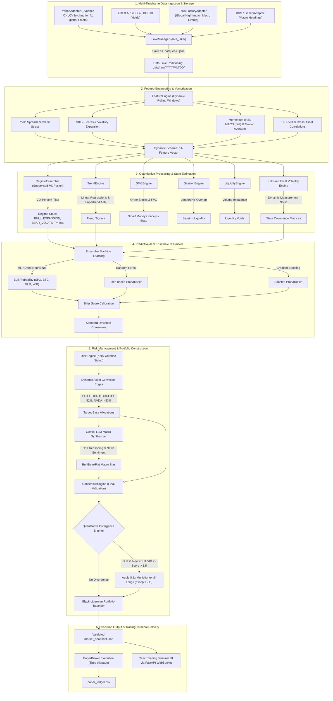

# Macro Briefing Agent Setup Guide (v6.5.0)

Welcome to the **Macro Briefing Agent (v6.5.0)**—a 24/7 autonomous containerized **Multi-Asset Trading Terminal & Dynamic Conviction Edge OS**. This project decouples data ingestion, economic calendars, LLM synthesis, consensus scaling, and pub-sub event dispatching into an enterprise-grade framework.

## Data Processing Workflow

The system operates continuously through a highly sophisticated, decoupled pipeline. 



### Detailed Processing Explanation
1. **Ingestion & Data Lake:** Every interval cycle, the orchestrator pulls live OHLCV data across 41 global tickers, macroeconomic yield data from FRED, and real-time news headlines. These are passed to the `LakeManager`, which safely persists the raw data partitioned by day in Parquet formats.
2. **Feature Engineering:** The raw price tables are then translated into mathematical feature arrays. We compute momentum indices (RSI, MACD), Volatility surface stress (VIX Z-Scores), and Bond Yield spreads to map the physical state of the market.
3. **Regime & Covariance:** The mathematical array is then evaluated by the **Regime Ensemble** (Random Forests & Gradient Boosters) to categorize the market state (e.g. `BULL_EXPANSION` or `CRISIS_DISLOCATION`). A Kalman Filter models covariance noise.
4. **Predictive Ensembles:** A Multi-Layer Perceptron (MLP Neural Network) merges the statistical regimes and feature matrices to predict future cumulative returns. Brier scores ensure the model isn't overfitting and scales signal allocations accordingly.
5. **Risk Allocation:** The raw predictions enter the `RiskEngine`, filtering out noise through "Dynamic Conviction Edges" (e.g. SPCE needs >72% conviction to trade, while SPX only needs >50%). Target Kelly weights are formulated.
6. **LLM Chain-of-Thought Validation:** Gemini 2.5 Flash analyzes parallel economic news and central bank statements. A Quantitative Divergence Slasher ensures that if the LLM detects "Bullish" narratives while the mathematical VIX signals extreme fear, capital is defensively slashed in half before executing.
7. **Unified Trade Synthesis & Conviction Gate:** The system evaluates Smart Money Concepts (SMC), Trend States, and the LLM Macro sentiment to generate a unified `TradeRecommendation`. A Regime-based Conviction Gate blocks execution if the quantitative Entry Score falls below a dynamically required threshold. Instead of suffering cash-drag, the system leverages Regime-Aware Baselines (e.g. holding 15% SPX during clear Bull Expansions) to maintain market tracking.
8. **Paper Broker & Dashboard:** Finally, the target portfolio weights are executed by the simulated `PaperBroker` and instantly dispatched via WebSockets to the React frontend UI.

---

## Project Structure Overview
The project is organized into a highly decoupled, professional modular pipeline:
- **`config/`**: Contains your API keys and webhook configurations (`fred_api_key.txt`, `api_keys.json`, etc.).
- **`src/adapters/`**: Physical retrieval clients (`yahoo_adapter.py`, `gemini_adapter.py`, `paper_broker.py`) implementing interface layers.
- **`src/engines/`**: Specialized mathematical engines (`feature_engine.py`, `regime_ensemble.py`, `risk_engine.py`, `consensus_engine.py`).
- **`src/fetch_market_data.py`**: Central Conductor orchestrating the ingestion, inference, and execution sequence.
- **`docs/`**: Documentation and System Architecture Manuals.
- **`data/`**: Structured subdirectories isolating state, telemetry, Data Lake Parquet partitions, and Paper Ledgers.
- **`frontend/`**: Full React/Vite web application providing the sleek Trading Terminal Dashboard.

---

## Docker Architecture & Storage

This system is fully containerized for seamless, reproducible deployment. The architecture utilizes two main containers:
- **`quant_backend`**: A headless Python container that runs the `fetch_market_data.py` Conductor and the FastAPI web server on Port 8000.
- **`quant_frontend`**: Serving the compiled React/Vite Glassmorphism dashboard on Port 80.

### Where is the container data stored?
We use **Docker Bind Mounts** in `docker-compose.yml` to achieve native persistence:
- `./data:/app/data`: Your market snapshots, logs, paper trading ledgers, and data lakes are saved directly to your Mac.
- `./config:/app/config`: Your API keys and webhooks are mapped natively to the backend container.

Because the data physically lives in your `agent` directory, **the folder is completely portable**. You can safely stop the containers and run `docker-compose up` again without losing your paper trading history or trained models.

### Docker Quickstart
To boot the entire OS, open your terminal inside the `agent` folder and run:
```bash
# Build and start the backend and frontend
docker-compose up -d --build

# View real-time logs
docker logs -f quant_backend
```

Once running, **open your web browser to `http://localhost`** to view the live trading dashboard!

---

## Data Privacy & Security Architecture

To protect proprietary trading strategies, local model calibrations, and personal API keys, this repository implements a strict **zero-sharing security architecture**. All sensitive parameters, private execution logs, locally trained model binaries, and generated briefings are strictly ignored by `.gitignore` and kept local.

### Configuration Templates (`config/`)
- `fred_api_key.example.txt` -> `fred_api_key.txt` (Holds Federal Reserve API keys)
- `api_keys.example.json` -> `api_keys.json` (Holds Google Gemini API keys)
- `webhook_config.example.txt` -> `webhook_config.txt` (Holds Discord webhook channel URLs)

## 1. Agent Setup

### API Keys & Configuration Setup
To configure operational parameters, API keys, and configurations:

1. **FRED API Yield Feeds (Optional fallback available):**
   - Go to the [FRED website](https://fred.stlouisfed.org/) and register to get a free FRED API key.
   - Duplicate the FRED API example configuration file:
     ```bash
     cp config/fred_api_key.example.txt config/fred_api_key.txt
     ```
   - Open `config/fred_api_key.txt` and paste your API key.
   - *Note: If this key is omitted or missing, the system dynamically activates yfinance proxy fallbacks (`^TNX` & `^FVX`).*

2. **Gemini 2.5 Flash LLM Integrations (News Parsing & Reasoning Synthesis):**
   - Obtain a Gemini API key from Google AI Studio.
   - Duplicate the Gemini API JSON-keys example template:
     ```bash
     cp config/api_keys.example.json config/api_keys.json
     ```
   - Open `config/api_keys.json` and paste your Gemini API key:
     ```json
     {
       "GEMINI_API_KEY": "your_actual_key_here"
     }
     ```
   - *Note: We utilize `gemini-2.5-flash` natively, which bypasses the restrictive free-tier limits of 2.0 while keeping inference speeds lightning fast.*

---

## 2. System Architecture & Technical Manual

For a full breakdown of the mathematical engines, data ingestion layers, penalty filters, consensus logic, and paper trading ledgers, please refer to the **Technical Developer Manual** located at:
`docs/concept_and_model.md`

---

## 3. Discord Push Setup

The agent can push executed paper trades and macro reasoning alerts to a Discord channel using a webhook.

1. Open Discord and go to the channel where you want the reports to be sent.
2. Click the gear icon next to the channel name to open **Edit Channel** -> **Integrations** -> **Webhooks** -> **New Webhook**.
3. Name your webhook and click **Copy Webhook URL**.
4. Copy the pre-packaged webhook example file to its active name:
   ```bash
   cp config/webhook_config.example.txt config/webhook_config.txt
   ```
5. Open `config/webhook_config.txt` and paste your copied Webhook URL into this file and save it.

---

## 4. Offline Model Training & Backtesting

The agent's deep learning components (Random Forests and MLP Classifiers) are not static. You must periodically retrain them on new market data to maintain their edge.

1. Boot the backend container using `docker-compose up -d`.
2. Connect to the container and run the offline training script:
   ```bash
   docker exec -it quant_backend python3 src/train_models.py
   ```
3. The script will fetch 5 years of historical data, re-fit the Random Forest Regimes, retrain the Deep Neural Network, and generate updated historical performance statistics.
4. The agent will automatically begin using the updated models on its next execution cycle!

---

## 5. Troubleshooting & Logs

Because the engine orchestrator runs invisibly via `APScheduler` inside Docker, you won't see pop-ups if it succeeds or fails. 

To view the real-time execution telemetry and see what the conductor is doing:
```bash
docker logs -f quant_backend
```

If you encounter any front-end React crashes, the UI is protected by **React Error Boundaries**. Rather than displaying a blank white screen, the tab will safely catch the error and present a styled "Component Crashed" card with a reload button.

---

## 6. Dynamic System Toggles

The v6.5.0 dashboard introduces sophisticated control mechanisms for live data interactions:

### Global Timezone Dropdown
By clicking the clock in the top-right corner of the UI, you can select your preferred Timezone (e.g., LOCAL, UTC, EST, JST, ICT). This globally transforms all timestamp strings instantly across the entire dashboard (Macro Events, Mock Executions, Reports) without refreshing.

### Universe Configuration
Inside the **[ LEDGER ]** tab, there is a **[ UNIVERSE CONFIGURATION ]** module. This allows you to dynamically enable or disable the 8 traded assets on the fly. When an asset is toggled OFF, the quantitative engine Mathematically Diverts 100% of the capital allocated to that specific asset directly into your `Cash` reserves, preserving mathematical integrity while completely neutralizing execution risk on that ticker. After toggling assets, you can click **[ RE-RUN BACKTEST ]** to recalculate portfolio PnL.
