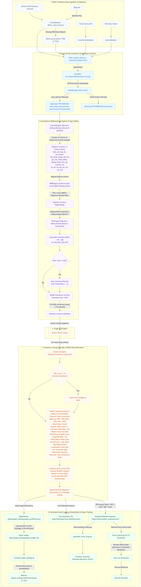

# Macro Briefing Agent Setup Guide (v6.4.0)

Welcome to the **Macro Briefing Agent (v6.4.0)**—a 24/7 autonomous containerized **Multi-Asset Trading Terminal & Dynamic Conviction Edge OS**. This project decouples data ingestion, economic calendars, LLM synthesis, consensus scaling, and pub-sub event dispatching into an enterprise-grade framework.



## Project Structure Overview
The project is organized into a highly decoupled, professional modular pipeline:
- **`config/`**: Contains your API keys and webhook configurations (`fred_api_key.txt`, `webhook_config.txt`, `api_keys.json`, `tuning_configs.json`, etc.).
- **`src/`**: Houses the core Python code organized as modular packages:
  - **`interfaces/`**: Standardized OOP interfaces (`data_broker.py`, `llm_provider.py`) defining loose-coupling contracts.
  - **`adapters/`**: Physical retrieval clients (`yahoo_adapter.py` for dynamic interval and yield history, `gemini_adapter.py` for LLM analysis, `forexfactory_adapter.py` for economic calendars, `paper_broker.py` for simulated execution rebalancing) implementing interface layers.
  - **`data_lake/`**: Database partition manager (`lake_manager.py`) handling daily-partitioned Parquet/JSONL.
  - **`engines/`**: Specialized engines (`feature_engine.py` for dynamic stats, return percentages and yield shifts, `hmm_engine.py` for regime and GARCH penalty filters, `risk_engine.py` for covariance noise & Kelly overrides, `consensus_engine.py` for signal mapping, `frequency_controller.py` for dynamic trading cadences, `rl_agent.py` for PPO-based reinforcement learning portfolio sizing).
  - **`observability/`**: Standardized context logging (`logger.py`) and pub-sub event dispatching (`event_bus.py`).
  - **`schemas/`**: Strict type-validation layer (`models.py`) housing Pydantic models for the entire pipeline state.
  - **`fetch_market_data.py`**: Central Conductor orchestrating the ingestion, inference, RL sizing, and paper execution sequence using dependency injection.
  - **`build_report.py`, `build_weekly_synthesis.py`**: Presentation and formatting compilation scripts.
  - **`push_to_discord.py`**: Secured push delivery agent.
  - **`training/`**: `rl_environment.py`, `rl_trainer.py`, `train_models.py`, `backtest.py`, `tune_hyperparameters.py` for model training, reinforcement learning, auditing, and tuning meta-agents.
  - **`generate_visual_map.py`**: Centralized stacked portfolio visualization generator script.
  - **`visualize_paper_trading.py`**: Paper trading dashboard plotter and Excel ledger exporter.
- **`docs/`**: Documentation and System Architecture Manuals (`concept_and_model.md`).
- **`data/`**: Structured subdirectories isolating state and logs:
  - **`data/state/`**: Active validations snapshot matrices (`market_snapshot.json`, `market_snapshot_prior.json`).
  - **`data/predictions/`**: Calibration forecast history logs (`mlp_predictions_history_{interval}.json`).
  - **`data/telemetry/`**: Phase 2 telemetry metrics payload (`live_telemetry.json`).
  - **`data/paper_trading/`**: Live simulated paper portfolios and transaction ledgers (`paper_portfolio.json`, `paper_ledger.csv`).
  - **`data/raw/`**: The local partitioned Data Lake structured as `YYYY/MM/DD/` directories housing Parquet price tables and partitioned event logs (`events.jsonl`).
- **`models/`**: Saved machine learning models and scaler binaries.
- **`reports/`**: Mapped output briefings, backtest records, paper trading PNG dashboards, and XLSX spreadsheets.
- **`logs/`**: Execution, error, and immutable audit logs.
- **`Dockerfile`, `docker-compose.yml`, `requirements.txt`**: Complete containerization and deployment configurations.

---

## Docker Architecture & Storage

This system is fully containerized for seamless, reproducible deployment. The architecture utilizes two main containers:
- **`quant_backend`**: A headless Python container that runs the internal `APScheduler` and the FastAPI server. It handles data ingestion, ML inference, paper trading execution, and JSON state management.
- **`quant_frontend`**: Serving the compiled React/Vite Glassmorphism dashboard on Port 80.

### Where is the container data stored?
Docker containers are managed internally by the Docker Engine, but **all of your actual data and configurations are securely stored inside your `agent` folder**.
We use **Docker Bind Mounts** in `docker-compose.yml` to achieve this:
- `./data:/app/data`: Your market snapshots, logs, paper trading ledgers, and data lakes are saved directly to your Mac.
- `./config:/app/config`: Your API keys and webhooks are mapped natively to the backend container.

Because the data physically lives in your `agent` directory, **the folder is completely portable**. You can safely stop the containers, move the folder to a cloud server, and run `docker-compose up` without losing your paper trading history or trained models.

### Docker Quickstart
To boot the entire OS, open your terminal inside the `agent` folder and run:
```bash
# Build and start the backend and frontend
docker-compose up -d --build

# View real-time logs
docker logs -f quant_backend
```

---


## Data Privacy & Security Architecture

To protect proprietary trading strategies, local model calibrations, and personal API keys, this repository implements a strict **zero-sharing security architecture**. All sensitive parameters, private execution logs, locally trained model binaries, and generated briefings are strictly ignored by `.gitignore` and kept local.

To set up the agent locally without exposing your personal keys or data, copy the provided skeleton templates to their active counterparts:

### Configuration Templates (`config/`)
- `fred_api_key.example.txt` -> `fred_api_key.txt` (Holds Federal Reserve API keys)
- `gemini_api_key.example.txt` -> `gemini_api_key.txt` (Holds Gemini LLM API keys)
- `webhook_config.example.txt` -> `webhook_config.txt` (Holds Discord webhook channel URLs)
- `api_keys.example.json` -> `api_keys.json` (Holds Google Gemini API keys for hyperparameter tuning & news processing)
- `tuning_configs.json` (Generated locally by the hyperparameter meta-agent)

### Offline Data Templates (`data/`)
- `market_snapshot.example.json` -> `market_snapshot.json` (Local market metric skeleton)
- `predictions_history.example.json` -> `predictions_history.json` (Past inference accuracy tracker)

This architecture guarantees that all private API credentials, locally computed GARCH volatilities, model weights, and session briefings are completely insulated, preventing accidental leaks to public code repositories.

## 1. Agent Setup

### Prerequisites
Ensure you have **Python 3** installed on your system. You will also need to install the required Python packages.

1. Open your terminal and navigate to the agent directory:
   ```bash
   cd /Users/mac/agent
   ```
2. Install the required dependencies:
   ```bash
   pip3 install -r requirements.txt
   ```

### API Keys & Configuration Setup
To configure operational parameters, API keys, and configurations:

1. **FRED API Yield Feeds (Optional fallback available):**
   - Go to the [FRED website](https://fred.stlouisfed.org/) and register to get a free FRED API key.
   - Duplicate the FRED API example configuration file:
     ```bash
     cp config/fred_api_key.example.txt config/fred_api_key.txt
     ```
   - Open `config/fred_api_key.txt` and paste your API key. (Or `export FRED_API_KEY="your_key"`).
   - *Note: If this key is omitted or missing, the system dynamically activates yfinance proxy fallbacks (`^TNX` & `^FVX`).*

2. **Gemini LLM Integrations (News Parsing & Hyperparameter Tuning):**
   - Obtain a Gemini API key from Google AI Studio.
   - Duplicate the Gemini API JSON-keys example template:
     ```bash
     cp config/api_keys.example.json config/api_keys.json
     ```
   - Open `config/api_keys.json` and paste your Gemini API key:
     ```json
     {
       "GEMINI_API_KEY": "your_actual_key_here"
     }
     ```

3. **Weekly LLM Synthesis (Optional):**
   - Duplicate the Gemini weekly synthesizer text key:
     ```bash
     cp config/gemini_api_key.example.txt config/gemini_api_key.txt
     ```
   - Open `config/gemini_api_key.txt` and paste your key.

---

## 2. System Architecture & Technical Manual

The agent is now structured under the **v6.4.0 Multi-Asset Trading Terminal & Dynamic Conviction Edge OS**, featuring centralized LLM synthesis, type-safe validations, in-memory `EventBus` pub-sub, paper broker execution engines, short ETF mapping, and Docker container support.

For a full breakdown of the mathematical engines, data ingestion layers, GARCH penalty filters, consensus logic, and paper trading ledgers, please refer to the **Technical Developer Manual** located at:
`docs/concept_and_model.md`

---


## 3. Discord Push Setup

The agent can push generated reports to a Discord channel using a webhook.

### Create a Webhook
1. Open Discord and go to the channel where you want the reports to be sent.
2. Click the gear icon next to the channel name to open **Edit Channel**.
3. Go to **Integrations** > **Webhooks** > **New Webhook**.
4. Name your webhook and click **Copy Webhook URL**.

### Configure the Agent
1. Copy the pre-packaged webhook example file to its active name:
   ```bash
   cp config/webhook_config.example.txt config/webhook_config.txt
   ```
2. Open `config/webhook_config.txt` in the agent folder.
3. Paste your copied Webhook URL into this file and save it.
4. (Optional) If you want to ping a specific role for Elevated/Critical alerts, open `config/role_config.txt` and paste the Discord Role ID (e.g., `<@&1234567890>`). If left empty, it defaults to no ping (silent notifications).

---


## 5. Offline Model Training & Backtesting

The agent's deep learning components (HMM and MLP Classifier) are not static. You must periodically retrain them on new market data to maintain their edge.

1. Once a quarter, open your terminal.
2. Run the offline training script:
   ```bash
   python3 /Users/mac/agent/src/train_models.py
   ```
3. The script will fetch 5 years of historical data, re-fit the Hidden Markov Models, retrain the Deep Neural Network, and generate updated historical performance statistics in `reports/backtest_results.md`.
4. The agent will automatically begin using the updated models on its next 4-hour cron cycle!


## 7. Troubleshooting & Logs

Because Cron runs invisibly, you won't see pop-ups if it succeeds or fails. To check on it, you can view the log file. Both the Python scripts and your cron jobs will write out helpful error messages there.

Open Terminal and run this command to see the latest activity:
```bash
tail -n 20 /Users/mac/agent/logs/cron.log
```
This will show you the output of the most recent automated runs!

---


## 9. Instant Quick-Start (Offline Skeleton Mode)

If you are a new user and want to immediately test the report generation interface offline without fetching live Yahoo Finance/FRED APIs or setting up API keys, follow these two steps:

1. Copy the pre-packaged skeleton files in the `data/` directory to their active file names:
   ```bash
   cp data/market_snapshot.example.json data/market_snapshot.json
   cp data/predictions_history.example.json data/predictions_history.json
   ```
2. Manually generate a test report instantly by running the report compiler:
   ```bash
   python3 src/build_report.py
   ```

The script will instantly parse the offline skeleton metrics, execute the voting consensus matrices, and produce a beautifully structured, institutional-grade market briefing under `reports/updates/`—working entirely offline!

