# Concept and Model: v6.3.0 Multi-Asset Trading Terminal & Dynamic Conviction Edge OS

## Core Concept
The Macro Briefing Agent has evolved into a fully autonomous, multi-asset trading engine capable of processing mathematical models for an array of global assets, specifically: `SPX`, `BTC`, `GLD`, `WTI`, `NVDA`, `TSLA`, `DELL`, and `SPCE`. 

Unlike traditional trading systems that utilize static thresholds, v6.3.0 introduces the **Dynamic Conviction Edge OS**. This framework evaluates not only the direction of an asset but enforces extremely strict, mathematically optimal "edges" based on the underlying volatility and beta profile of that specific asset.

## 1. Dynamic Asset Conviction Edge
The Risk Engine ([src/engines/risk_engine.py](file:///Users/mac/agent/src/engines/risk_engine.py)) has been overhauled to apply per-asset Kelly Criterion base thresholds:
- **Core Index (`spx`)**: `> 50%` win probability threshold (lowered to maximize participation in strong regimes).
- **Safe Havens / Cryptos / Commodities**:
  - `btc`: `> 52%` win probability threshold.
  - `gld`: `> 52%` win probability threshold.
  - `wti`: `> 54%` win probability threshold.
- **Single-Name Tech / Extreme Beta**:
  - `nvda`: `> 53%` win probability threshold.
  - `tsla`: `> 56%` win probability threshold.
  - `dell`: `> 55%` win probability threshold.
  - `spce`: `> 72%` win probability threshold (extremely strict to filter out speculative noise).

If the neural network's `bull_probability` does not drastically exceed these base edges, the Kelly Allocator will return exactly `0.0`, sitting in cash rather than risking capital on low-conviction noise.

## 2. Auto-Inversion & Calibration Penalties
To counteract overfitted mean-reversion during strong directional trends, the system actively monitors the `Brier Score` (a measure of model calibration). 
If the Brier Score exceeds `0.60`, the Risk Engine triggers **Auto-Inversion** (`1.0 - prob`), recognizing that the neural network is completely misaligned with the current regime and actively fading its primary signal.

## 3. Multi-Asset Trading Terminal & Short Leg Execution
The frontend React architecture has been entirely restructured. The outdated paper-trading lists have been replaced with a professional `TradingTerminal.jsx` interface. 
- Integrated `lightweight-charts` to provide highly performant, sub-millisecond rendering of OHLCV data.
- **Backtest / Live Toggle Integration:** Dynamic markers are overlaid directly on the chart, displaying precisely where the algorithm rotated capital in and out of different assets.
- **Short Leg Execution:** The system supports active short positions in paper trading by mapping `Short_Kelly` to the ProShares Short S&P500 ETF (`SH`), executing rebalances in inverse direction during down-trends.

## 4. Algorithmic Outage Degradation
To prevent a single asset's data outage (e.g., Yahoo Finance failing to deliver `DELL` data) from crashing the pipeline, the `quantitative_backtester.py` and `fetch_market_data.py` pipelines wrap inference in isolated `try/except` blocks. If one asset's model fails, it defaults to a neutral `0.5` probability with `0.0` consensus, allowing the rest of the portfolio to continue trading uninterrupted.

## 5. Softened Regime Gates and Safe Rotation Order
- In high-volatility liquidity rallies, the Kalman filter and HMM often mischaracterize the market as `risk_off` or `CRISIS_DISLOCATION`. We softened this gate to apply a **0.5x scaling penalty** instead of a hard zero on the core SPX position, keeping exposure alive during major rallies.
- The Capital Rotation Engine has been moved to execute **AFTER** the universal regime and HMM coherence gates. This ensures that when single-name high-beta tech assets are forbidden (zeroed out), they are not re-amplified by the SPX rotation boost.
- The Retail Noise Filter has been deactivated to prevent unnecessary 50% suppression of high-conviction signals.

## 6. Core Bug Fixes and Code Alignment
To ensure model fidelity and operational stability under stress, the following 11 bug fixes were implemented:

1. **RL Policy Evaluation Guard:** Disabled experimental reinforcement learning policy inference (`self.use_rl_agent = False`) in [src/fetch_market_data.py](file:///Users/mac/agent/src/fetch_market_data.py) to prevent uncalibrated policy outputs from leaking into target allocations.
2. **Feature Rolling Window Alignment:** Set `self.dynamic_rolling_window = 20` inside [src/fetch_market_data.py](file:///Users/mac/agent/src/fetch_market_data.py) to ensure alignment between real-time data frame generation and the historical feature metrics.
3. **Feature Label Remapping:** Adjusted the ordered feature keys inside [src/fetch_market_data.py](file:///Users/mac/agent/src/fetch_market_data.py) from `spx_macd` to `spx_macd_hist` to align with the output keys defined in [src/engines/feature_engine.py](file:///Users/mac/agent/src/engines/feature_engine.py).
4. **Selective Divergence Capital Slasher:** Configured the quantitative divergence module in [src/fetch_market_data.py](file:///Users/mac/agent/src/fetch_market_data.py) to slash Kelly exposure across all long positions by 50% *except* for the safe-haven gold proxy (`GLD_Kelly`), defending capital without muting defensive positions.
5. **Immediate Bond State Synchronization:** Updated the data ingestion pipeline inside [src/fetch_market_data.py](file:///Users/mac/agent/src/fetch_market_data.py) to map `self.snapshot.bonds = bonds` immediately when fetched in `handle_data_fetched`.
6. **Drawdown Scope Restriction:** Restricted stop-loss check routines in [src/engines/market_event_detector.py](file:///Users/mac/agent/src/engines/market_event_detector.py) to only process `SPX` position updates, avoiding erroneous stop approaches triggered on stock single-names using SPX close values.
7. **Missing HMM File Fallback:** Implemented robust file-existence checks and regime default guards in [src/fetch_market_data.py](file:///Users/mac/agent/src/fetch_market_data.py) for cases where HMM pickle files are unavailable on disk.
8. **Rotation Ordering & Regime Locks:** Relocated the Capital Rotation Engine in [src/engines/risk_engine.py](file:///Users/mac/agent/src/engines/risk_engine.py) to run strictly after regime gates and HMM locks, and guarded it to block execution when the Kalman filter indicates `dominant_state == 'risk_off'`.
9. **Naïve Datetime Resolution:** Standardized timezone representation in [src/quantitative_backtester.py](file:///Users/mac/agent/src/quantitative_backtester.py) and [src/fetch_market_data.py](file:///Users/mac/agent/src/fetch_market_data.py) to handle naïve datetimes under Python 3.9 by enforcing explicit UTC mapping.
10. **Inverse ETF Short Allocation Mapping:** Registered ProShares Short S&P500 ETF (`SH`) as active target allocation in [src/engines/risk_engine.py](file:///Users/mac/agent/src/engines/risk_engine.py) and added it to the `ALL_YF_TICKERS` registry mapping in [src/adapters/paper_broker.py](file:///Users/mac/agent/src/adapters/paper_broker.py).
11. **Race-Condition Drawdown Elimination:** Removed local file-system writes of portfolio drawdown figures in [src/quantitative_backtester.py](file:///Users/mac/agent/src/quantitative_backtester.py) to prevent disk lock contention during multi-threaded stress runs.

## v6.4.0 Multi-Asset Trading Terminal & Dynamic Conviction Edge OS

The data pipeline operates as an enterprise-grade containerized event-driven OS featuring parallel LLM experts, step-by-step Chain-of-Thought (CoT) verification, and quantitative divergence protection filters:

```mermaid
graph TD
    %% Define Styles & Classes (Neon Lime-Pink Night Canvas Scheme)
    classDef IngestStyle fill:#f7fafc,stroke:#e2e8f0,stroke-width:1.5px,color:#4a5568;
    classDef ConductorStyle fill:#ebf8ff,stroke:#bee3f8,stroke-width:2px,color:#2b6cb0;
    classDef FeatureStyle fill:#fff5f5,stroke:#feb2b2,stroke-width:2px,color:#9b2c2c;
    classDef EngineStyle fill:#faf5ff,stroke:#e9d8fd,stroke-width:2px,color:#553c9a;
    classDef RiskStyle fill:#fffaf0,stroke:#feebc8,stroke-width:2px,color:#c05621;
    classDef OutputStyle fill:#f0fff4,stroke:#c6f6d5,stroke-width:2px,color:#22543d;

    %% 1. Ingestion Phase
    subgraph Ingestion["1. Multi-Timeframe Data Ingestion & Storage"]
        YF["YahooAdapter (Dynamic OHLCV fetching for 41 global tickers)"]
        FRED["FRED API (DGS2, DGS10 Yields)"]
        FF["ForexFactoryAdapter (Global High-Impact Macro Events)"]
        News["RSS / GeminiAdapter (Macro Headings)"]
        LakeManager["LakeManager (data_lake/)"]
        Parquet["Data Lake Partitioning: data/raw/YYYY/MM/DD/"]
        
        YF --> LakeManager
        FRED --> LakeManager
        FF --> LakeManager
        News --> LakeManager
        LakeManager -->|"Save as .parquet & .jsonl"| Parquet
    end

    %% 2. Feature Engineering
    subgraph FeatureEngineering["2. Feature Engineering & Vectorization"]
        Parquet --> FE["FeatureEngine (Dynamic Rolling Windows)"]
        FE --> F_Spreads["Yield Spreads & Credit Stress"]
        FE --> F_Vol["VIX Z-Scores & Volatility Expansion"]
        FE --> F_Mom["Momentum (RSI, MACD_hist) & Moving Averages"]
        FE --> F_Corr["SPX-VIX & Cross-Asset Correlations"]
        F_Spreads & F_Vol & F_Mom & F_Corr --> Schema1["Pydantic Schema: 14-Feature Vector"]
    end

    %% 3. Quantitative Processing (Regimes & Trends)
    subgraph QuantProcessing["3. Quantitative Processing & State Estimation"]
        Schema1 --> HMM["HMMEngine (Hidden Markov Model)"]
        HMM -->|"VIX GARCH Penalty Filter"| Regime["Regime State: BULL_EXPANSION, BEAR_VOLATILITY, etc."]
        
        Schema1 --> Trend["TrendEngine"]
        Trend -->|"Linear Regressions & Supertrend ATR"| TrendState["Trend Signals: LONG / SHORT / FLAT"]
        
        Schema1 --> KF["KalmanFilter & Volatility Engine"]
        KF -->|"Dynamic Measurement Noise (R)"| VolState["State Covariance Matrices"]
    end

    %% 4. AI & Ensembles
    subgraph AI["4. Predictive AI & Ensemble Classifiers"]
        Regime & TrendState & VolState --> Ens["Ensemble Machine Learning"]
        Ens -->|"MLP Deep Neural Net"| ProbMLP["Bull Probability (SPX, BTC, GLD, WTI)"]
        Ens -->|"Random Forest"| ProbRF["Tree-based Probabilities"]
        Ens -->|"Gradient Boosting"| ProbGB["Boosted Probabilities"]
        
        ProbMLP & ProbRF & ProbGB --> Calib["Brier Score Calibration"]
        Calib -->|"Score > 0.60?"| Inv["Auto-Inversion (1.0 - P)"]
        Calib -->|"Score <= 0.60"| Cons["Standard Deviation Consensus"]
        Inv --> Cons
    end

    %% 5. Risk & Execution
    subgraph Risk["5. Risk Management & Portfolio Construction"]
        Cons --> RE["RiskEngine (Kelly Criterion Sizing)"]
        
        RE --> Edge["Dynamic Asset Conviction Edges"]
        Edge -->|"SPX > 50%, BTC/GLD > 52%, NVDA > 53%"| TargetAlloc["Target Base Allocations"]
        
        TargetAlloc --> MacroLLM["Gemini LLM Macro Synthesizer"]
        MacroLLM -->|"CoT Reasoning & News Sentiment"| LLMSignal["Bull/Bear/Flat Macro Bias"]
        
        LLMSignal & TargetAlloc --> ConsensusEng["ConsensusEngine (Final Validation)"]
        ConsensusEng --> DivCheck{"Quantitative Divergence Slasher"}
        DivCheck -->|"Bullish News BUT VIX Z-Score > 1.5"| Slash["Apply 0.5x Multiplier to all Longs (except GLD)"]
        DivCheck -->|"No Divergence"| BlackLitterman["Black-Litterman Portfolio Balancer"]
        Slash --> BlackLitterman
    end

    %% 6. Output
    subgraph Out["6. Execution Output & Trading Terminal Delivery"]
        BlackLitterman --> Snap["Validated market_snapshot.json"]
        Snap --> PB["PaperBroker Execution (5bps slippage)"]
        PB --> Ledger["paper_ledger.csv"]
        Snap --> Terminal["React Trading Terminal UI via FastAPI WebSocket"]
    end

    %% Assign classes
    class YF,FRED,FF,News,LakeManager,Parquet IngestStyle;
    class FE,F_Spreads,F_Vol,F_Mom,F_Corr,Schema1 FeatureStyle;
    class HMM,Regime,Trend,TrendState,KF,VolState EngineStyle;
    class Ens,ProbMLP,ProbRF,ProbGB,Calib,Inv,Cons EngineStyle;
    class RE,Edge,TargetAlloc,MacroLLM,LLMSignal,ConsensusEng,DivCheck,Slash,BlackLitterman RiskStyle;
    class Snap,PB,Ledger,Terminal OutputStyle;
```

## Core Script Ecosystem & Ingestion Flow

The Python architecture is structured as a modular quantitative pipeline. Below is the operational workflow and structural breakdown of the scripts housed in `src/`:

1. **`fetch_market_data.py` (The Enterprise Conductor Orchestrator)**
   - **Dependency Injection:** Instantiates and injects concrete providers (`YahooAdapter`, `ForexFactoryAdapter`, `GeminiAdapter`, `LakeManager`, `HMMEngine`, `RiskEngine`, `ConsensusEngine`, `PaperBroker`) dynamically.
   - **EventBus Pub-Sub Sequence (`src/observability/event_bus.py`):** Runs the pipeline as a series of decoupled events (`SystemStart` -> `DataFetched` -> `FeaturesEngineered` -> `EnginesCompleted` -> `PipelineComplete`).
   - **Structured Logging & Global Interception (`src/data_lake/lake_manager.py`):** Captures every event fired in the system and logs it directly to `events.jsonl` under daily partitioned folders: `data/raw/YYYY/MM/DD/events.jsonl`.
   - **Type-Safe Validation (`src/schemas/models.py`):** Enforces strict data structure contracts using Pydantic, incorporating `EconomicCalendar` and `EconomicEvent` schemas.
   - **Asset Ingestion & Parquet Partitioning:** Ingests price series and economic calendar feeds, saving them to daily partitioned Parquet tables.
   - **Feature Construction (`src/engines/feature_engine.py`):** Computes returns, Gold-to-Silver ratio, volume heat, credit stress, indices, and 14-feature space matrices.
   - **Regime Inference & Sizing (`src/engines/hmm_engine.py` & `src/engines/risk_engine.py`):** Computes multi-fractal regimes, runs Kalman filter state tracking, and solves Kelly portfolio sizing.
   - **Mixture of Experts & CoT Synthesis (`src/adapters/gemini_adapter.py` & `src/engines/consensus_engine.py`):** 
     - Runs the Macro Policy and Market Psychology experts in parallel using `ThreadPoolExecutor`.
     - Synthesizes their CoT step-by-step reasoning blocks and scores into a unified `NewsSignal`.
     - **Critical Divergence Slasher:** If news is extremely bullish, but VIX z-score spikes > 1.5, triggers `quantitative_divergence_flag: true` to dynamically slash Kelly exposure by half (0.5x multiplier) to defend capital.
     - Employs `gemini-2.5-flash` to gracefully bypass quota 429 errors.
   - **Paper Broker Execution (`src/adapters/paper_broker.py`):** Simulates real-time rebalancing based on Kelly target fractions with 5 bps slippage, logging to `data/paper_trading/paper_ledger.csv`, and publishing embedded trade execution alerts directly to Discord.

2. **`build_report.py` (Consensus Engine & Presentation Compiler)**
   - **Resilient Log Fetching:** Scans the data lake partitions, finds the latest `events.jsonl` log file, extracts the `PipelineComplete` event payload, and validates it against the `MarketSnapshot` Pydantic model.
   - **Deterministic Voting:** Aggregates quantitative indicators and computes conviction-weighted votes.
   - **Epistemic Kelly Sizing:** Solves target portfolio exposure sizing calibrated by Brier scores and regime decays. Applies a **1.2x aggressive multiplier** (up to 120% exposure) during liquidity-driven rallies, a **0.5x slasher** during rate shocks, and a **0.5x capital slasher** during quantitative narrative-reality divergences.
   - **Presentation:** Formats the mathematical state matrices, `Quant Divergence` status, and step-by-step `[ LLM REASONING ]` CoT logical synthesis blocks into the minimalist Brutalist Markdown template, and triggers the Discord webhook pusher.

3. **`build_weekly_synthesis.py` (Weekly Macro Research Synthesizer)**
   - **Narrative Assembly:** Executed weekly to build a comprehensive summary.
   - **Resilient Log Fetching:** Reads the latest `events.jsonl` daily partitioned event logs and validates the snap using `MarketSnapshot`.
   - **Dual-Mode Generation:** Always outputs the deterministic mathematical matrix, and appends the Gemini-Flash generated weekly synthesis incorporating the 30-day quantitative memory log.
   - **Delivery:** Triggers the Discord webhook agent to push the weekly summary.

4. **`push_to_discord.py` (Pusher Agent & Secure Gatekeeper)**
   - **Security Screening:** Runs input filenames through strict regex validation profiles to block malicious local directory path traversal.
   - **Metadata Extraction:** Parses briefing documents for session details, timestamps, sentiment headers, and system alerts.
   - **Embed Formatting:** Dynamically styles Discord embeds using alert-tier hex colors (Green for `ROUTINE`, Yellow for `ELEVATED`, Red for `CRITICAL`, Blue for `DAILY`).
   - **Notifications:** Coordinates automated role pings for higher-priority critical situations and securely uploads full markdown files under a 7MB size ceiling.

5. **`train_models.py` (Offline Machine Learning Training Pipeline)**
   - **Data Compiling:** Pulls 5 years of historical multi-asset data including equities, index futures, dollar index, commodities, and volatility.
   - **HMM Calibration:** Standardizes the 14 aligned feature dimensions (S&P 500, DXY, VIX, WTI, GSR, USDCAD, BTC, US10Y daily change, 2s10s spread, and returns of ES, NQ, YM, RTY futures) and fits a 6-state `GaussianHMM` with full covariance matrices over 500 EM iterations.
   - **MLP Calibration:** Trains a multi-layer perceptron neural network using a `(16, 8)` hidden layer topology with ReLU activation and Adam solver, mapping features to a 5-day forward cumulative return target (0=Risk-Off, 1=Risk-On, 2=Transitional). Saves model binaries to `models/`.

6. **`backtest.py` (Empirical Backtest Audit Engine)**
   - **Viterbi Decoding:** Loads the active models and decodes 2 years of daily market features into chronological state labels sequence.
   - **Statistical Auditing:** Measures mean daily returns, annualizes SPX/WTI metrics, and compiles daily yield changes (in basis points) across all 6 regimes, outputting a clear performance audit (`reports/backtest_extended_results.md`) to verify quantitative edge before live deployment.

7. **`tune_hyperparameters.py` (Hyperparameter Tuning Meta-Agent)**
   - **Macro Calibration:** A standalone scheduled python script that analyzes central bank summaries, FOMC minutes, or Beige Books via the Gemini LLM.
   - **JSON Configuration Injection:** Outputs structural macroeconomic velocity metrics into a local configuration schema (`tuning_configs.json`), allowing `fetch_market_data.py` to adapt dynamic half-life variables automatically.

8. **`visualize_paper_trading.py` (Paper Trading Performance Dashboard)**
   - **Performance curves:** Computes and plots curves tracking realized returns, unrealized equity fluctuations, net PnL, and cumulative transaction friction fees paid.
   - **Chronological Ledgers:** Exports execution logs to a dual-sheet spreadsheet `/Users/mac/agent/reports/paper_trading_performance.xlsx` containing the comprehensive trade ledger and performance metrics summary.

9. **`visualize_math_4h.ipynb` & `visualize_math_1w.ipynb` (Dual Interactive Math Visualizers)**
   - **Visual Overlay:** Plots HMM state boundaries directly overlaid on the S&P 500 price chart.
   - **Fragility & Backwardation Heatmap:** Visualizes structural fragility states, including Volatility Term Structure backwards curves (VIX9D vs VIX).
   - **Gemini Geopolitical Shock Visualizer:** Plots semantic shock decodes against a horizontal red line representing the critical **0.70 Geopolitical Shock Trigger** boundary.
   - **Kelly Sizing Curves:** Plots real-time allocation transitions and duration half-life decay patterns natively within VS Code.
