# Concept and Model: v6.5.0 Multi-Asset Trading Terminal & Dynamic Conviction Edge OS

## Core Concept
The Macro Briefing Agent has evolved into a fully autonomous, multi-asset trading engine capable of processing mathematical models for an array of global assets, specifically: `SPX`, `BTC`, `GLD`, `WTI`, `NVDA`, `TSLA`, `DELL`, and `SPCE`. 

Unlike traditional trading systems that utilize static thresholds, v6.5.0 operates a **Dynamic Conviction Edge OS**. This framework evaluates not only the direction of an asset but enforces extremely strict, mathematically optimal "edges" based on the underlying volatility and beta profile of that specific asset.

## 1. Dynamic Asset Conviction Edge
The Risk Engine (`src/engines/risk_engine.py`) has been overhauled to apply per-asset Kelly Criterion base thresholds:
- **Core Index (`SPX`)**: `> 50%` win probability threshold (lowered to maximize participation in strong regimes).
- **Safe Havens / Cryptos / Commodities**:
  - `BTC`: `> 52%` win probability threshold.
  - `GLD`: `> 52%` win probability threshold.
  - `WTI`: `> 54%` win probability threshold.
- **Single-Name Tech / Extreme Beta**:
  - `NVDA`: `> 53%` win probability threshold.
  - `TSLA`: `> 56%` win probability threshold.
  - `DELL`: `> 55%` win probability threshold.
  - `SPCE`: `> 72%` win probability threshold (extremely strict to filter out speculative noise).

If the neural network's `bull_probability` does not drastically exceed these base edges, the Kelly Allocator will return exactly `0.0`, sitting in cash rather than risking capital on low-conviction noise.

## 2. Dynamic Calibration Penalties
To counteract overfitted mean-reversion during strong directional trends, the system actively monitors the `Brier Score` (a measure of model calibration). 
If the Brier Score indicates degraded performance, the Risk Engine applies proportional **Calibration Penalties**, scaling back allocations rather than naively inverting signals, protecting capital during transition phases.

## 3. Multi-Asset Trading Terminal & Short Leg Execution
The frontend React architecture has been entirely restructured. The system runs entirely inside a Dockerized stack providing a professional Glassmorphism web dashboard on Port 80.
- Integrated `lightweight-charts` to provide highly performant rendering of OHLCV data.
- **Backtest / Live Toggle Integration:** Dynamic markers are overlaid directly on the chart, displaying precisely where the algorithm rotated capital in and out of different assets.
- **Short Leg Execution:** The system supports active short positions in paper trading by mapping `Short_Kelly` to the ProShares Short S&P500 ETF (`SH`), executing rebalances in inverse direction during down-trends.

## 4. Algorithmic Outage Degradation
To prevent a single asset's data outage (e.g., Yahoo Finance failing to deliver `DELL` data) from crashing the pipeline, the engines wrap inference in isolated `try/except` blocks. If one asset's model fails, it defaults to a neutral `0.5` probability with `0.0` consensus, allowing the rest of the portfolio to continue trading uninterrupted.

## 5. Softened Regime Gates and Safe Rotation Order
- In high-volatility liquidity rallies, the Kalman filter and Regime Ensemble often mischaracterize the market as `risk_off` or `CRISIS_DISLOCATION`. We softened this gate to apply a **0.5x scaling penalty** instead of a hard zero on the core SPX position, keeping exposure alive during major rallies.
- The Capital Rotation Engine has been moved to execute **AFTER** the universal regime and Ensemble locks. This ensures that when single-name high-beta tech assets are forbidden (zeroed out), they are not re-amplified by the SPX rotation boost.

## 6. Core Bug Fixes and Code Alignment
To ensure model fidelity and operational stability under stress, key fixes implemented in v6.5.0 include:

1. **Feature Rolling Window Alignment:** Set `self.dynamic_rolling_window = 20` to ensure alignment between real-time data frame generation and the historical feature metrics.
2. **Feature Label Remapping:** Adjusted ordered feature keys from `spx_macd` to `spx_macd_hist`.
3. **Selective Divergence Capital Slasher:** Configured the quantitative divergence module to slash Kelly exposure across all long positions by 50% *except* for the safe-haven gold proxy (`GLD_Kelly`), defending capital without muting defensive positions.
4. **Immediate Bond State Synchronization:** Updated the ingestion pipeline to map `self.snapshot.bonds = bonds` immediately when fetched.
5. **Drawdown Scope Restriction:** Restricted stop-loss check routines to only process `SPX` position updates.
6. **Ensemble Fallbacks:** Added safety fallbacks to `regime_ensemble.py` if trained models are absent.
7. **Rotation Ordering & Regime Locks:** Relocated Capital Rotation to run strictly after regime gates.
8. **Inverse ETF Short Allocation Mapping:** Registered ProShares Short S&P500 ETF (`SH`) as active target allocation.
9. **React Error Boundaries:** Wrapped the frontend tabs in `ErrorBoundary.jsx` components so corrupted JSON payloads safely render a fallback UI.
10. **API Hardening:** Locked previously exposed endpoints with `dependencies=[Depends(require_auth)]`.
11. **Parallel RSS Fetching:** Replaced sequential feed fetching with a `ThreadPoolExecutor` and 8-second global timeout, preventing stale feeds from hanging the pipeline.

## v6.5.0 Multi-Asset Trading Terminal & Dynamic Conviction Edge OS

The data pipeline operates as an enterprise-grade containerized event-driven OS featuring parallel LLM experts, step-by-step Chain-of-Thought (CoT) verification, and quantitative divergence protection filters.

```mermaid
graph TD
    %% Define Styles & Classes (Neon Lime-Pink Night Canvas Scheme)
    classDef IngestStyle fill:#f7fafc,stroke:#e2e8f0,stroke-width:1.5px,color:#4a5568;
    classDef ConductorStyle fill:#ebf8ff,stroke:#bee3f8,stroke-width:2px,color:#2b6cb0;
    classDef FeatureStyle fill:#fff5f5,stroke:#feb2b2,stroke-width:2px,color:#9b2c2c;
    classDef EngineStyle fill:#faf5ff,stroke:#e9d8fd,stroke-width:2px,color:#553c9a;
    classDef RiskStyle fill:#fffaf0,stroke:#feebc8,stroke-width:2px,color:#c05621;
    classDef OutputStyle fill:#f0fff4,stroke:#c6f6d5,stroke-width:2px,color:#22543d;

    %% 1. Ingestion Phase
    subgraph Ingestion["1. Multi-Timeframe Data Ingestion & Storage"]
        YF["YahooAdapter (Dynamic OHLCV fetching for 41 global tickers)"]
        FRED["FRED API (DGS2, DGS10 Yields)"]
        FF["ForexFactoryAdapter (Global High-Impact Macro Events)"]
        News["RSS / GeminiAdapter (Macro Headings)"]
        LakeManager["LakeManager (data_lake/)"]
        Parquet["Data Lake Partitioning: data/raw/YYYY/MM/DD/"]
        
        YF --> LakeManager
        FRED --> LakeManager
        FF --> LakeManager
        News --> LakeManager
        LakeManager -->|"Save as .parquet & .jsonl"| Parquet
    end

    %% 2. Feature Engineering
    subgraph FeatureEngineering["2. Feature Engineering & Vectorization"]
        Parquet --> FE["FeatureEngine (Dynamic Rolling Windows)"]
        FE --> F_Spreads["Yield Spreads & Credit Stress"]
        FE --> F_Vol["VIX Z-Scores & Volatility Expansion"]
        FE --> F_Mom["Momentum (RSI, MACD_hist) & Moving Averages"]
        FE --> F_Corr["SPX-VIX & Cross-Asset Correlations"]
        F_Spreads & F_Vol & F_Mom & F_Corr --> Schema1["Pydantic Schema: 14-Feature Vector"]
    end

    %% 3. Quantitative Processing (Regimes & Trends)
    subgraph QuantProcessing["3. Quantitative Processing & State Estimation"]
        Schema1 --> Regime["RegimeEnsemble (Supervised ML)"]
        Regime -->|"VIX Penalty Filter"| RegimeState["Regime State: BULL_EXPANSION, BEAR_VOLATILITY, etc."]
        
        Schema1 --> Trend["TrendEngine"]
        Trend -->|"Linear Regressions & Supertrend ATR"| TrendState["Trend Signals: LONG / SHORT / FLAT"]
        
        Schema1 --> KF["KalmanFilter & Volatility Engine"]
        KF -->|"Dynamic Measurement Noise (R)"| VolState["State Covariance Matrices"]
    end

    %% 4. AI & Ensembles
    subgraph AI["4. Predictive AI & Ensemble Classifiers"]
        RegimeState & TrendState & VolState --> Ens["Ensemble Machine Learning"]
        Ens -->|"MLP Deep Neural Net"| ProbMLP["Bull Probability (SPX, BTC, GLD, WTI)"]
        Ens -->|"Random Forest"| ProbRF["Tree-based Probabilities"]
        Ens -->|"Gradient Boosting"| ProbGB["Boosted Probabilities"]
        
        ProbMLP & ProbRF & ProbGB --> Calib["Brier Score Calibration"]
        Calib --> Cons["Standard Deviation Consensus"]
    end

    %% 5. Risk & Execution
    subgraph Risk["5. Risk Management & Portfolio Construction"]
        Cons --> RE["RiskEngine (Kelly Criterion Sizing)"]
        
        RE --> Edge["Dynamic Asset Conviction Edges"]
        Edge -->|"SPX > 50%, BTC/GLD > 52%, NVDA > 53%"| TargetAlloc["Target Base Allocations"]
        
        TargetAlloc --> MacroLLM["Gemini LLM Macro Synthesizer"]
        MacroLLM -->|"CoT Reasoning & News Sentiment"| LLMSignal["Bull/Bear/Flat Macro Bias"]
        
        LLMSignal & TargetAlloc --> ConsensusEng["ConsensusEngine (Final Validation)"]
        ConsensusEng --> DivCheck{"Quantitative Divergence Slasher"}
        DivCheck -->|"Bullish News BUT VIX Z-Score > 1.5"| Slash["Apply 0.5x Multiplier to all Longs (except GLD)"]
        DivCheck -->|"No Divergence"| BlackLitterman["Black-Litterman Portfolio Balancer"]
        Slash --> BlackLitterman
    end

    %% 6. Output
    subgraph Out["6. Execution Output & Trading Terminal Delivery"]
        BlackLitterman --> Snap["Validated market_snapshot.json"]
        Snap --> PB["PaperBroker Execution (5bps slippage)"]
        PB --> Ledger["paper_ledger.csv"]
        Snap --> Terminal["React Trading Terminal UI via FastAPI WebSocket"]
    end

    %% Assign classes
    class YF,FRED,FF,News,LakeManager,Parquet IngestStyle;
    class FE,F_Spreads,F_Vol,F_Mom,F_Corr,Schema1 FeatureStyle;
    class Regime,RegimeState,Trend,TrendState,KF,VolState EngineStyle;
    class Ens,ProbMLP,ProbRF,ProbGB,Calib,Inv,Cons EngineStyle;
    class RE,Edge,TargetAlloc,MacroLLM,LLMSignal,ConsensusEng,DivCheck,Slash,BlackLitterman RiskStyle;
    class Snap,PB,Ledger,Terminal OutputStyle;
```

## Core Script Ecosystem & Ingestion Flow

The Python architecture is structured as a modular quantitative pipeline. Below is the operational workflow and structural breakdown of the scripts housed in `src/`:

1. **`fetch_market_data.py` (The Enterprise Conductor Orchestrator)**
   - **Dependency Injection:** Instantiates and injects concrete providers (`YahooAdapter`, `ForexFactoryAdapter`, `GeminiAdapter`, `LakeManager`, `RegimeEnsemble`, `RiskEngine`, `ConsensusEngine`, `PaperBroker`) dynamically.
   - **EventBus Pub-Sub Sequence (`src/observability/event_bus.py`):** Runs the pipeline as a series of decoupled events (`SystemStart` -> `DataFetched` -> `FeaturesEngineered` -> `EnginesCompleted` -> `PipelineComplete`).
   - **Structured Logging & Global Interception (`src/data_lake/lake_manager.py`):** Captures every event fired in the system and logs it directly to `events.jsonl` under daily partitioned folders.
   - **Type-Safe Validation (`src/schemas/models.py`):** Enforces strict data structure contracts using Pydantic.
   - **Asset Ingestion & Parquet Partitioning:** Ingests price series and economic calendar feeds, saving them to daily partitioned Parquet tables.
   - **Feature Construction (`src/engines/feature_engine.py`):** Computes returns, Gold-to-Silver ratio, volume heat, credit stress, indices, and 14-feature space matrices.
   - **Regime Inference & Sizing (`src/engines/regime_ensemble.py` & `src/engines/risk_engine.py`):** Computes macro regimes, runs Kalman filter state tracking, and solves Kelly portfolio sizing.
   - **Mixture of Experts & CoT Synthesis (`src/adapters/gemini_adapter.py` & `src/engines/consensus_engine.py`):** 
     - Runs the Macro Policy and Market Psychology experts in parallel using `ThreadPoolExecutor`.
     - Synthesizes their CoT step-by-step reasoning blocks and scores into a unified `NewsSignal`.
     - Employs `gemini-2.5-flash` natively to gracefully bypass quota 429 limits.
   - **Paper Broker Execution (`src/adapters/paper_broker.py`):** Simulates real-time rebalancing based on Kelly target fractions with 5 bps slippage.

2. **`build_report.py` (Consensus Engine & Presentation Compiler)**
   - **Resilient Log Fetching:** Scans the data lake partitions, finds the latest `events.jsonl` log file, extracts the `PipelineComplete` event payload, and validates it.
   - **Deterministic Voting:** Aggregates quantitative indicators and computes conviction-weighted votes.
   - **Epistemic Kelly Sizing:** Solves target portfolio exposure sizing calibrated by Brier scores and regime decays. 
   - **Presentation:** Formats the mathematical state matrices, `Quant Divergence` status, and step-by-step logical synthesis blocks into Markdown.

3. **`train_models.py` (Offline Machine Learning Training Pipeline)**
   - **Data Compiling:** Pulls 5 years of historical multi-asset data including equities, index futures, dollar index, commodities, and volatility.
   - **Regime Calibration:** Trains Random Forest and Gradient Boosting ensembles to classify structural market regimes without reliance on outdated HMM logic.
   - **MLP Calibration:** Trains a multi-layer perceptron neural network using a `(16, 8)` hidden layer topology mapping features to forward cumulative returns. Saves model binaries to `models/`.

4. **`backtest.py` (Empirical Backtest Audit Engine)**
   - **Evaluation:** Loads the active models and decodes 2 years of daily market features into chronological state labels sequence.
   - **Statistical Auditing:** Measures mean daily returns, annualizes SPX/WTI metrics, and compiles daily yield changes (in basis points) across all regimes, outputting a clear performance audit.

## New in v6.5.0
- **AdvancedRealTimeChart Integration**: Seamless replacement of lightweight-charts with the official TradingView Advanced Chart widget for 1:1 replica of institutional trading terminals, including full multi-timeframe capability and built-in technical indicators.
- **Precision PnL Mathematical Engine**: Backend API mathematically derives Unrealized PnL from exact Open Positions (`Total Equity - Cash`), forcing zero drift and perfectly absorbing all execution slippage and commissions into Realized PnL.
- **Enhanced Aesthetic Profile**: Streamlined visual styling, removal of distracting icons/emojis, and adoption of professional institutional color palettes.
